# 面试技术篇

# Redis

​	主要分为两种情况：使用场景和其他面试题。

### 使用场景

​	主要分为：**缓存**、**分布式锁**、计数器、保存token、消息队列、延迟队列。

* 缓存：穿透、击穿、雪崩、双写一致、持久化、数据过期、淘汰策略。
* 分布式锁：setnx、redisson（底层实现原理）
* 计数器：incrby命令

* 数据类型：保存token（String）、消息队列（list）、延迟队列（Zset）

**举例**

* redis的数据持久化策略有哪些
* 什么是缓存穿透，怎么解决
* 什么是布隆过滤器
* 什么是缓存击穿，怎么解决
* 什么是缓存雪崩，怎么解决
* redis双写问题
* redis分布式锁如何实现
* redis实现分布式锁如何合理的控制锁的有效时长
* redis的数据过期策略有哪些
* redis的数据淘汰策略有哪些

### 其他面试题

​	主要分为：集群、事务、Redis为什么快？

* 集群：主从、哨兵、集群
* 事务
* redis为什么快

**举例**

* Redis集群有哪些方案，知道嘛
* 什么是Redis主从同步
* 你们使用Redis是单点还是集群？哪种集群Redis分片集群中，数据是怎么存储和读取redis集群
* 怎么保证redis的高并发高可用
* 你们用过Redis的事务吗？事务的命令有哪些？
* Redis是单线程的，但是为什么还那么快？

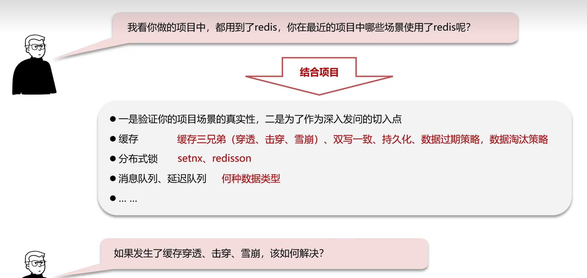

## 缓存

### 正常缓存流程

* 根据搜索条件查询，先对redis进行查询，查询到了返回数据。
* redis查询不到，对DB进行查询，将数据返回给redis进行保存，再将结果返回。

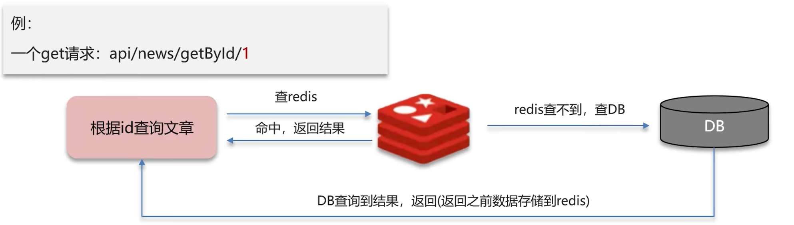

### 缓存穿透

​	原因：查询一个不存在的数据，mysql查询不到数据，也不会直接写入缓存，就会导致每次请求都查数据库，如果请求的量足够大，就会击垮数据库，导致宕机。

* 解决方案1：缓存空数据，查询返回的数据为空，仍把这个结果塞到缓存。（KEY:1,VALUE:NULL）
  * 优点：简单，方便
  * 缺点：消耗内存（如果对方的攻击是很多种key的），可能会发生不一致的问题（原本为null，后面真的存入了该数据，就导致不一致的问题）。

* 解决方法2：布隆过滤器
  * 一开始预热数据库数据到redis时，同时预热布隆过滤器。

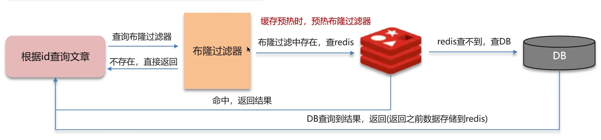

#### 布隆过滤器

​	布隆过滤器实现依赖于bitmap（位图），相当于是一个以bit位为单位的数组，数组中每个单元只能存储二进制0或者1。

* 布隆过滤器作用：布隆过滤器可以用于检索一个元素是否在一个集合中。
* 存储数据：id为1的数据，通过多个hash函数获取hash值，根据hash计算对应位置改为1
* 查询数据：使用相同hash函数，获取hash值，判断对应位置是否都为1，都为1说明是同一个key。

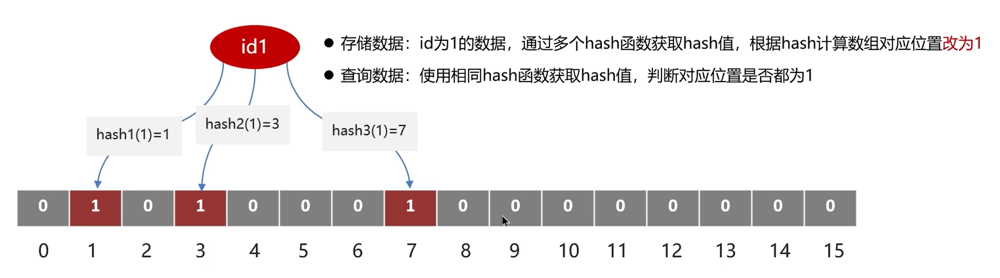

**误判情况**

* id为1的数据，hash结果为：1，3，7。
* id为2的数据，hash结果为：9，12，14。
* id为3的数据，不存在，但hash结果为：3，9，12。布隆过滤器会以为存在。

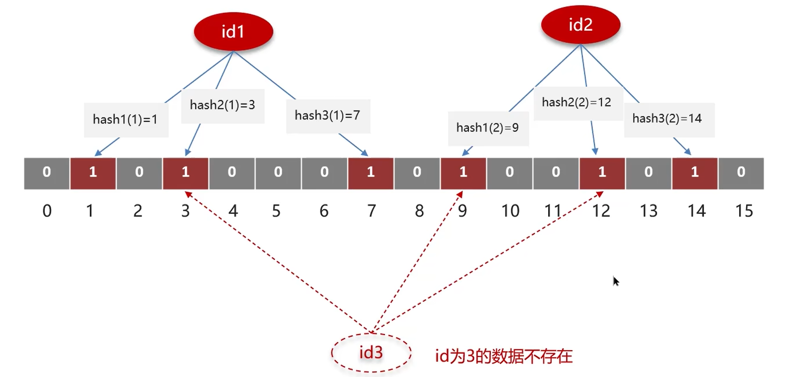

误判率：数组越小误判率越大，数组越大误判率越低，但是同时带来更多的内存消耗。**

#### 设置误判率

​	误判率不可能不存在的，要么增加数组，要么增加误判率，一般设置在百分之五以内。

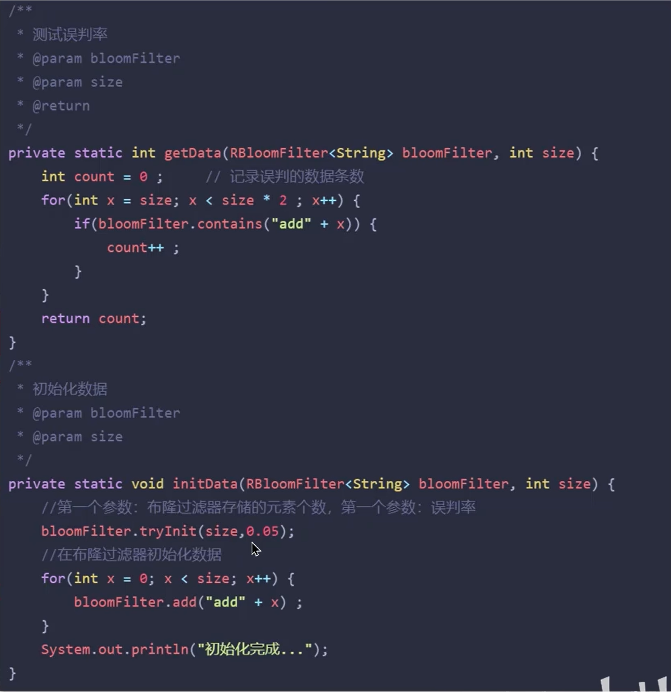

#### 布隆过滤器具体实现方案

* Redisson
* Guava

总结：什么是缓存穿透，怎么解决？

* 缓存穿透：查询一个不存在的数据，mysql查询不到数据也不会直接写入缓存，就会导致每次请求都落到数据库上。
* 解决方案一：缓存空数据
* 解决方案二：布隆过滤器

### 缓存击穿

​	给某一个key设置了过期时间，当key过期的时候，恰好这时间点对这个key有大量并发请求过来，这些并发请求可能瞬间把db压垮。

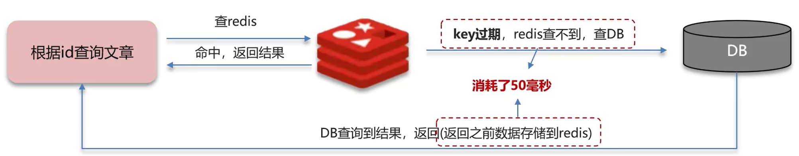

* 解决方案1：互斥锁（分布式锁）
  * 线程1：
    * 查询缓存，未命中
    * 获取互斥锁成功
    * 查询数据库重建缓存数据
    * 写入缓存
    * 释放锁
  * 线程2：
    * 查询缓存，未命中
    * 获取互斥锁失败
    * 再进行上面两步，直到线程1将数据写入到了缓存
  * 优点：保证数据的强一致性
  * 缺点：因为其他线程都在等待，性能差

* 解决方案2：逻辑过期（不设置过期时间）

  在存入缓存的时候，设置一个逻辑过期时间。

  * 线程1：
    * 查询缓存，发现逻辑时间已过期
    * 获取互斥锁成功
    * 开启新线程2（重点）
    * 返回过期数据
  * 线程2：
    * 查询数据重建缓存数据
    * 写入缓存，重置逻辑过期时间
    * 释放锁
  * 线程3：
    * 查询缓存，发现逻辑时间已过期
    * 获取互斥锁失败
    * 返回过期数据
  * 线程4：（此时线程2已经完成）
    * 命中缓存，缓存时间并没有过期
  * 优点：高可用（不管结果一不一致，先返回了再说），性能优。
  * 缺点：一致性不强。

* 方法总结：两种方案各有好坏，要根据场景使用，比如：
  * 跟钱有关的业务，通常需要保持强一致性，使用第一种方式。
  * 比较注重用户体验的业务，就需要尽量保持高可用和性能优，使用第二种方式。

总结：

* 缓存击穿：给某一个key设置了过期时间，当key过期的时候，恰好这时间点，这个key有大量并发请求过来，这些并发请求可能瞬间把数据库压垮。
  * 方案1：互斥锁，强一致性，性能差
  * 方案2：逻辑过期，高可用，性能优，但无法保证数据的绝对一致性

### 缓存雪崩

​	缓存雪崩是指，在同一时间段，**大量的缓存key同时失效或者Redis服务宕机**，导致大量请求到达数据库，带来巨大压力。

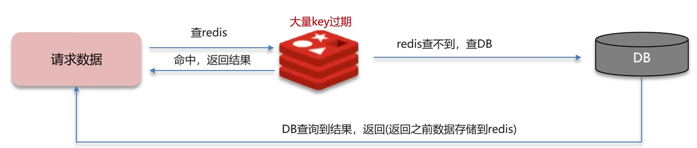

#### 解决方案

* 给不同的Key设置随机的过期时间即可。（缓存大面积失效）
* 利用Redis集群提高服务的可用性，比如：哨兵模式、集群模式（Redis宕机）

* 给缓存业务添加降级限流策略，比如nginx、或者springcloud gateway
  * 降级策略可以作为系统的保底层略，适用于穿透、击穿、雪崩。
* 给业务添加多级缓存，比如Guava或Caffeine

### 三兄弟打油诗

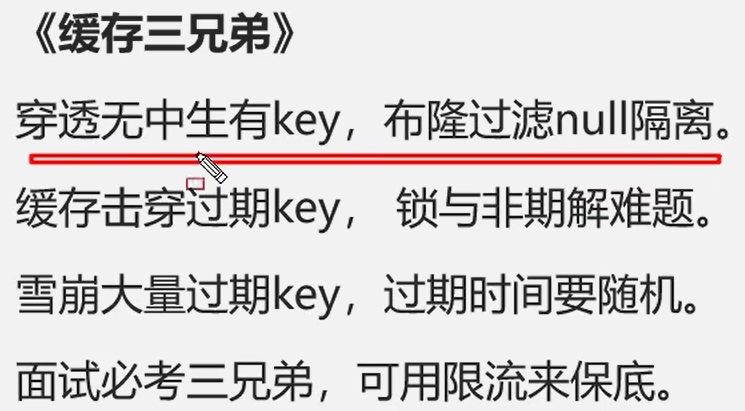

### 双写一致

​	当修改了数据库的数据也要同时更新缓存的数据，缓存和数据要保持一致。

注：根据自己的业务判断回答一致性要求高还是允许延迟一致性。

#### 读数据流程

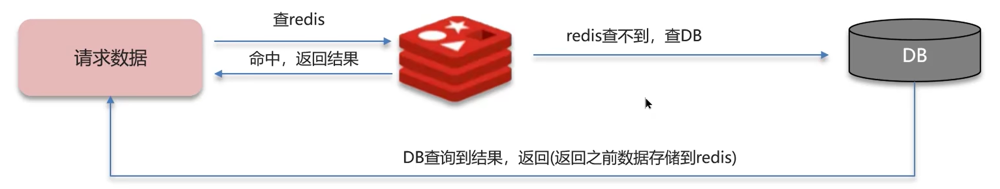

读操作：缓存命中，直接返回；缓存未命中查询数据库，写入缓存，设定超时时间。

写操作：延迟双删

#### 双写一致存在的问题

更新缓存分为：

* 先删除缓存--->修改数据库

  * 正常情况：数据初始为10，改为20
    * 线程1删除缓存10，修改数据库为20
    * 线程2查询缓存为空，查询数据库为20，更新缓存为20
  * 不正常情况：
    * 线程1删除缓存10
    * 线程2查询缓存为空，数据库查询为10，写入缓存为10
    * 线程1修改数据库为20

  出现了不一致的情况，这时候就需要再新增一次延迟删除缓存，即可同步。

* 先修改数据库--->删除缓存
  * 正常情况：
    * 线程2修改数据库为20，删除缓存10
    * 线程1查询缓存为空，查询数据库为20，写入缓存为20
  * 不正常情况1：此时缓存还没过期（这种情况是允许的）
    * 线程1：查询redis缓存，此时未过期，查询数据为10
    * 线程2：修改数据库为20，删除缓存。
  * 不正常情况2：此时缓存过期
    * 线程1：查询redis缓存为空，查询数据库为10
    * 线程2：修改数据库数据为20，删除缓存
    * 线程1：写入缓存10

#### 为什么要删除两次缓存？

​	当先修改数据库--->删除缓存出现数据库和缓存不一致的情况时，再延迟删除一次缓存，可以保证数据库和缓存的数据一致。

#### 为什么要延迟删除？（延迟一致性）

​	因为一般情况下，数据库是主从模式，是读写分离的，需要延时一会，让主机点把数据同步到从节点。 但是，延时多长时间，不好控制，所以说，延时极大程度的控制了脏数据的风险，但也只是控制了一部分。

**延迟双删**

优点：性能极高

缺点：还是有脏数据的风险，做不到强一致性

#### 分布式锁（读多写少）

​	强一致性，适用于和钱有关的金融业务，并且读多写少。

共享锁:读锁readLock，加锁之后，其他线程可以共享读操作

排他锁:独占锁writeLock，加锁之后，阻塞其他线程读写操作

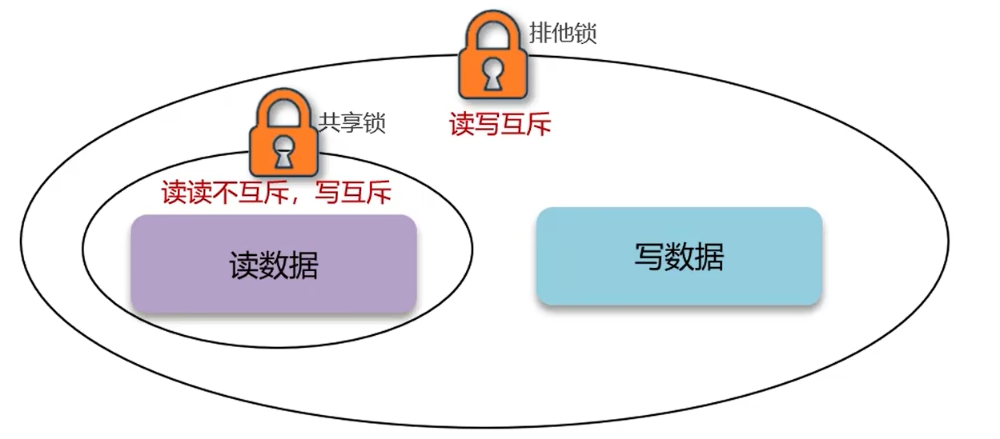

* 线程1：加写锁，写数据，删除缓存，释放锁
* 线程2：加读锁，读缓存未命中，读数据库，解锁

具体代码实现：Redisson

* 读操作：

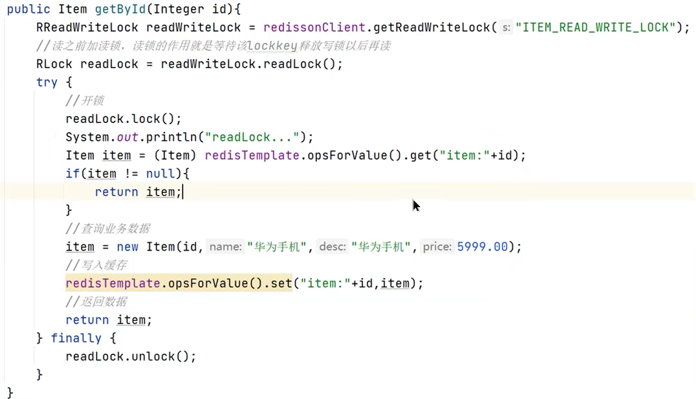

写操作：两个常量值需要一致（ITEM_READ_WRITE_LOCK）

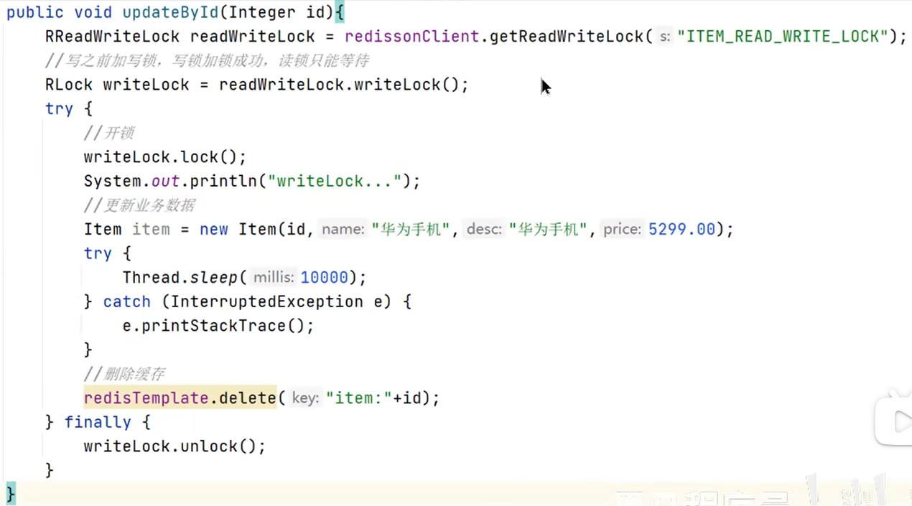

优点：强一致性

缺点：性能低

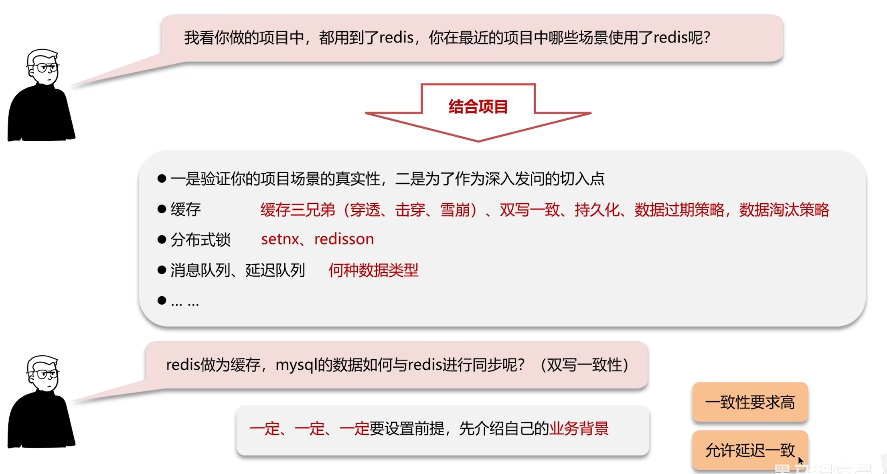

一致性要求高：使用分布式锁（性能低）

允许延迟一致：

* 异步通知保证数据的最终一致性

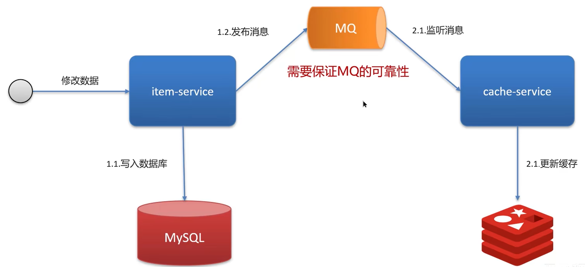

* 基于Cannal的异步通知
  * 好处：对于业务代码几乎0侵入

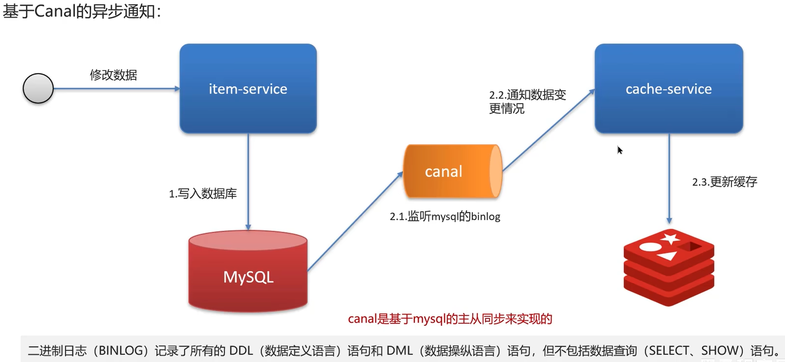

#### 面试问题

redis作为缓存，mysql的数据如何与redis进行同步？

* 介绍自己简历上的业务，我们当时是把文章的热点数据存入到缓存中，虽然是热点数据，但是实时要求性没有那么高，所以我们当时采用的是异步的方案同步数据。（高可用）
* 我们当时是把抢券的库存存入到了缓存中，这个需要实时进行数据同步，为了保证数据的强一致性，我们当时采用的是redisson提供的读写锁来保证数据的同步。（强一致性）

那你来介绍一下异步的方案

* 允许延时一致的业务，采用异步通知。
  * 使用MQ中间件，更新数据之后，通知缓存删除
  * 利用cannal中间件，不需要修改业务代码，伪装为mysql的一个从节点，canal通过读取binlog数据更新缓存

* 强一致性的，采用Redisson提供的读写锁
  * 共享锁：读锁readLock，加锁之后，其他线程可以共享读操作
  * 排他锁：独占锁writeLock，加锁之后，阻塞其他线程的读写操作。

### Redis持久化

redis作为缓存，数据的持久化是怎么做的？

* RDB(Redis database Backup file)：也叫Redis数据快照。
* AOF(Append Only File)：追加文件。

#### RDB实现持久化

​	简单来说就是把内存中的所有数据都记录到磁盘中。当Redis实例故障重启后，从磁盘读取快照文件，恢复数据。

* 人工操作：使用redis客户端执行命令
  * 一般使用bgsave命令

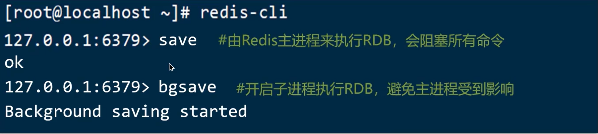

* Redis内部触发RDB机制：
  * 可以在redis.conf文件中找到，格式如下：

#### RDB执行原理？

​	bgsave开始时会fork主进程得到子进程，子进程共享主进程的内存数据。完成fork后读取内存数据并写入 RDB 文件。

* fork操作采用的是copy-on-write技术：
  * 当主进程执行读操作时，访问共享内存
  * 当主进程执行写操作时，则会拷贝一份数据，执行写操作

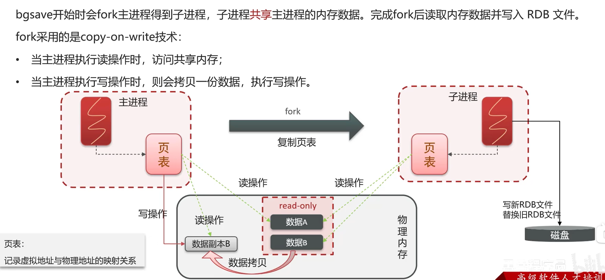

#### AOF

​	Redis处理的每一个写命令都会记录在AOF文件，可以看做是命令日志文件。

注：AOF默认是关闭的，我们要通过配置去开启。

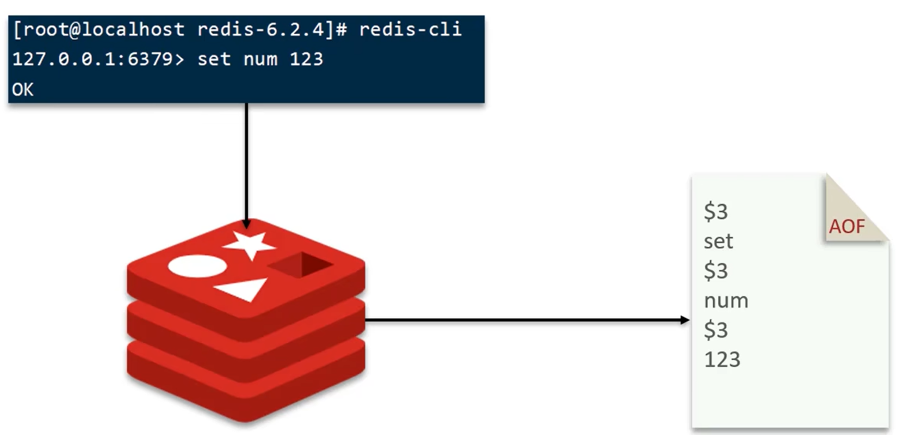

* 开启AOF操作

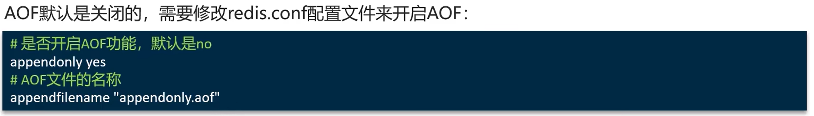

* 配置记录频率

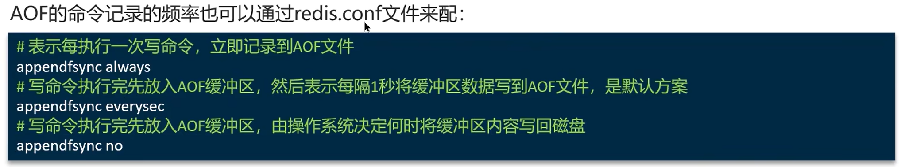

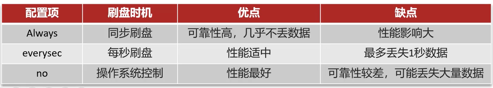

*  控制文件大小

​	因为是记录命令，AOF文件会比RDB文件大的多。而且AOF会记录对同一个key的多次写操作，但只有最后一次写操作才有意义。通过执行bgrewriteaof命令，可以让AOF文件执行重写功能，用最少的命令达到相同效果。

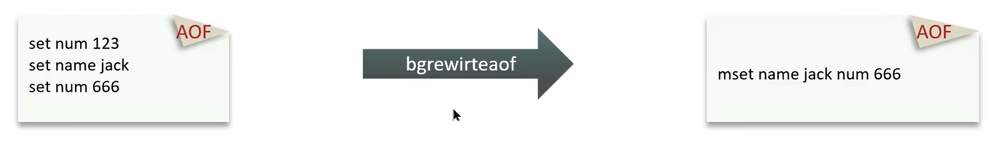

​	Redis也会在触发阈值时，自动去重写AOF文件。阈值可以在redis.conf中配置：

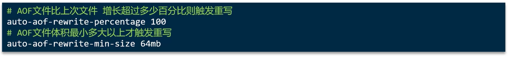

#### RDB和AOF对比

​	RDB和AOF各有自己的优缺点，如果对数据安全性要求较高，在实际开发中往往会结合两者来使用。

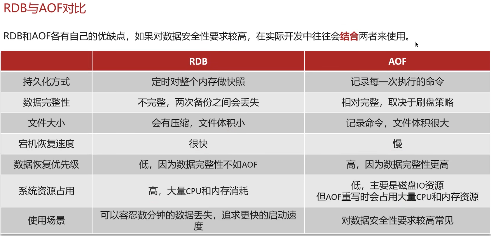