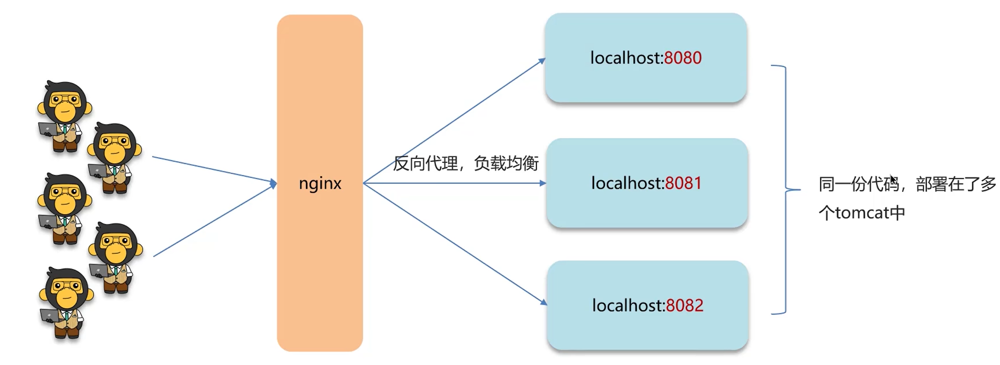
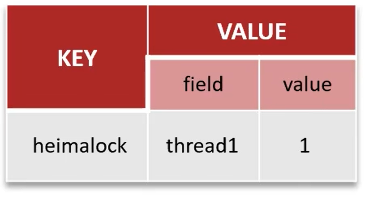
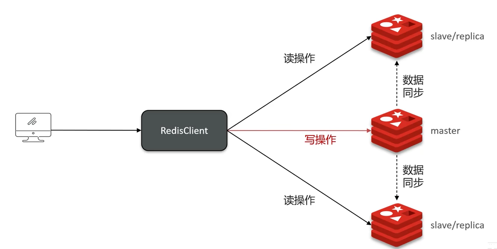

# 面试技术篇

# Redis

​	主要分为两种情况：使用场景和其他面试题。

### 使用场景

​	主要分为：**缓存**、**分布式锁**、计数器、保存token、消息队列、延迟队列。

* 缓存：穿透、击穿、雪崩、双写一致、持久化、数据过期、淘汰策略。
* 分布式锁：setnx、redisson（底层实现原理）
* 计数器：incrby命令

* 数据类型：保存token（String）、消息队列（list）、延迟队列（Zset）

**举例**

* redis的数据持久化策略有哪些
* 什么是缓存穿透，怎么解决
* 什么是布隆过滤器
* 什么是缓存击穿，怎么解决
* 什么是缓存雪崩，怎么解决
* redis双写问题
* redis分布式锁如何实现
* redis实现分布式锁如何合理的控制锁的有效时长
* redis的数据过期策略有哪些
* redis的数据淘汰策略有哪些

### 其他面试题

​	主要分为：集群、事务、Redis为什么快？

* 集群：主从、哨兵、集群
* 事务
* redis为什么快

**举例**

* Redis集群有哪些方案，知道嘛
* 什么是Redis主从同步
* 你们使用Redis是单点还是集群？Redis分片集群中，数据是怎么存储和读取redis集群
* 怎么保证redis的高并发高可用
* 你们用过Redis的事务吗？事务的命令有哪些？
* Redis是单线程的，但是为什么还那么快？
* redis主从数据同步的流程是什么？
* Redis集群脑裂该怎么解决？

## 缓存

### 正常缓存流程

* 根据搜索条件查询，先对redis进行查询，查询到了返回数据。
* redis查询不到，对DB进行查询，将数据返回给redis进行保存，再将结果返回。

### 缓存穿透

​	原因：查询一个不存在的数据，mysql查询不到数据，也不会直接写入缓存，就会导致每次请求都查数据库，如果请求的量足够大，就会击垮数据库，导致宕机。

* 解决方案1：缓存空数据，查询返回的数据为空，仍把这个结果塞到缓存。（KEY:1,VALUE:NULL）
  * 优点：简单，方便
  * 缺点：消耗内存（如果对方的攻击是很多种key的），可能会发生不一致的问题（原本为null，后面真的存入了该数据，就导致不一致的问题）。

* 解决方法2：布隆过滤器
  * 一开始预热数据库数据到redis时，同时预热布隆过滤器。

#### 布隆过滤器

​	布隆过滤器实现依赖于bitmap（位图），相当于是一个以bit位为单位的数组，数组中每个单元只能存储二进制0或者1。

* 布隆过滤器作用：布隆过滤器可以用于检索一个元素是否在一个集合中。
* 存储数据：id为1的数据，通过多个hash函数获取hash值，根据hash计算对应位置改为1
* 查询数据：使用相同hash函数，获取hash值，判断对应位置是否都为1，都为1说明是同一个key。

**误判情况**

* id为1的数据，hash结果为：1，3，7。
* id为2的数据，hash结果为：9，12，14。
* id为3的数据，不存在，但hash结果为：3，9，12。布隆过滤器会以为存在。

误判率：数组越小误判率越大，数组越大误判率越低，但是同时带来更多的内存消耗。**

#### 设置误判率

​	误判率不可能不存在的，要么增加数组，要么增加误判率，一般设置在百分之五以内。

#### 布隆过滤器具体实现方案

* Redisson
* Guava

总结：什么是缓存穿透，怎么解决？

* 缓存穿透：查询一个不存在的数据，mysql查询不到数据也不会直接写入缓存，就会导致每次请求都落到数据库上。
* 解决方案一：缓存空数据
* 解决方案二：布隆过滤器

### 缓存击穿

​	给某一个key设置了过期时间，当key过期的时候，恰好这时间点对这个key有大量并发请求过来，这些并发请求可能瞬间把db压垮。

* 解决方案1：互斥锁（分布式锁）
  * 线程1：
    * 查询缓存，未命中
    * 获取互斥锁成功
    * 查询数据库重建缓存数据
    * 写入缓存
    * 释放锁
  * 线程2：
    * 查询缓存，未命中
    * 获取互斥锁失败
    * 再进行上面两步，直到线程1将数据写入到了缓存
  * 优点：保证数据的强一致性
  * 缺点：因为其他线程都在等待，性能差

* 解决方案2：逻辑过期（不设置过期时间）

  在存入缓存的时候，设置一个逻辑过期时间。

  * 线程1：
    * 查询缓存，发现逻辑时间已过期
    * 获取互斥锁成功
    * 开启新线程2（重点）
    * 返回过期数据
  * 线程2：
    * 查询数据重建缓存数据
    * 写入缓存，重置逻辑过期时间
    * 释放锁
  * 线程3：
    * 查询缓存，发现逻辑时间已过期
    * 获取互斥锁失败
    * 返回过期数据
  * 线程4：（此时线程2已经完成）
    * 命中缓存，缓存时间并没有过期
  * 优点：高可用（不管结果一不一致，先返回了再说），性能优。
  * 缺点：一致性不强。

* 方法总结：两种方案各有好坏，要根据场景使用，比如：
  * 跟钱有关的业务，通常需要保持强一致性，使用第一种方式。
  * 比较注重用户体验的业务，就需要尽量保持高可用和性能优，使用第二种方式。

总结：

* 缓存击穿：给某一个key设置了过期时间，当key过期的时候，恰好这时间点，这个key有大量并发请求过来，这些并发请求可能瞬间把数据库压垮。
  * 方案1：互斥锁，强一致性，性能差
  * 方案2：逻辑过期，高可用，性能优，但无法保证数据的绝对一致性

### 缓存雪崩

​	缓存雪崩是指，在同一时间段，**大量的缓存key同时失效或者Redis服务宕机**，导致大量请求到达数据库，带来巨大压力。

#### 解决方案

* 给不同的Key设置随机的过期时间即可。（缓存大面积失效）
* 利用Redis集群提高服务的可用性，比如：哨兵模式、集群模式（Redis宕机）

* 给缓存业务添加降级限流策略，比如nginx、或者springcloud gateway
  * 降级策略可以作为系统的保底层略，适用于穿透、击穿、雪崩。
* 给业务添加多级缓存，比如Guava或Caffeine

### 三兄弟打油诗

### 双写一致

​	当修改了数据库的数据也要同时更新缓存的数据，缓存和数据要保持一致。

注：根据自己的业务判断回答一致性要求高还是允许延迟一致性。

#### 读数据流程

读操作：缓存命中，直接返回；缓存未命中查询数据库，写入缓存，设定超时时间。

写操作：延迟双删

#### 双写一致存在的问题

更新缓存分为：

* 先删除缓存--->修改数据库

  * 正常情况：数据初始为10，改为20
    * 线程1删除缓存10，修改数据库为20
    * 线程2查询缓存为空，查询数据库为20，更新缓存为20
  * 不正常情况：
    * 线程1删除缓存10
    * 线程2查询缓存为空，数据库查询为10，写入缓存为10
    * 线程1修改数据库为20

  出现了不一致的情况，这时候就需要再新增一次延迟删除缓存，即可同步。

* 先修改数据库--->删除缓存
  * 正常情况：
    * 线程2修改数据库为20，删除缓存10
    * 线程1查询缓存为空，查询数据库为20，写入缓存为20
  * 不正常情况1：此时缓存还没过期（这种情况是允许的）
    * 线程1：查询redis缓存，此时未过期，查询数据为10
    * 线程2：修改数据库为20，删除缓存。
  * 不正常情况2：此时缓存过期
    * 线程1：查询redis缓存为空，查询数据库为10
    * 线程2：修改数据库数据为20，删除缓存
    * 线程1：写入缓存10

#### 为什么要删除两次缓存？

​	当先修改数据库--->删除缓存出现数据库和缓存不一致的情况时，再延迟删除一次缓存，可以保证数据库和缓存的数据一致。

#### 为什么要延迟删除？（延迟一致性）

​	因为一般情况下，数据库是主从模式，是读写分离的，需要延时一会，让主机点把数据同步到从节点。 但是，延时多长时间，不好控制，所以说，延时极大程度的控制了脏数据的风险，但也只是控制了一部分。

**延迟双删**

优点：性能极高

缺点：还是有脏数据的风险，做不到强一致性

#### 分布式锁（读多写少）

​	强一致性，适用于和钱有关的金融业务，并且读多写少。

共享锁:读锁readLock，加锁之后，其他线程可以共享读操作

排他锁:独占锁writeLock，加锁之后，阻塞其他线程读写操作

* 线程1：加写锁，写数据，删除缓存，释放锁
* 线程2：加读锁，读缓存未命中，读数据库，解锁

具体代码实现：Redisson

* 读操作：

写操作：两个常量值需要一致（ITEM_READ_WRITE_LOCK）

优点：强一致性

缺点：性能低

一致性要求高：使用分布式锁（性能低）

允许延迟一致：

* 异步通知保证数据的最终一致性

* 基于Cannal的异步通知
  * 好处：对于业务代码几乎0侵入

#### 面试问题

redis作为缓存，mysql的数据如何与redis进行同步？

* 介绍自己简历上的业务，我们当时是把文章的热点数据存入到缓存中，虽然是热点数据，但是实时要求性没有那么高，所以我们当时采用的是异步的方案同步数据。（高可用）
* 我们当时是把抢券的库存存入到了缓存中，这个需要实时进行数据同步，为了保证数据的强一致性，我们当时采用的是redisson提供的读写锁来保证数据的同步。（强一致性）

那你来介绍一下异步的方案

* 允许延时一致的业务，采用异步通知。
  * 使用MQ中间件，更新数据之后，通知缓存删除
  * 利用cannal中间件，不需要修改业务代码，伪装为mysql的一个从节点，canal通过读取binlog数据更新缓存

* 强一致性的，采用Redisson提供的读写锁
  * 共享锁：读锁readLock，加锁之后，其他线程可以共享读操作
  * 排他锁：独占锁writeLock，加锁之后，阻塞其他线程的读写操作。

### Redis持久化

redis作为缓存，数据的持久化是怎么做的？

* RDB(Redis database Backup file)：也叫Redis数据快照。
* AOF(Append Only File)：追加文件。

#### RDB实现持久化

​	简单来说就是把内存中的所有数据都记录到磁盘中。当Redis实例故障重启后，从磁盘读取快照文件，恢复数据。

* 人工操作：使用redis客户端执行命令
  * 一般使用bgsave命令

* Redis内部触发RDB机制：
  * 可以在redis.conf文件中找到，格式如下：

#### RDB执行原理？

​	bgsave开始时会fork主进程得到子进程，子进程共享主进程的内存数据。完成fork后读取内存数据并写入 RDB 文件。

* fork操作采用的是copy-on-write技术：
  * 当主进程执行读操作时，访问共享内存
  * 当主进程执行写操作时，则会拷贝一份数据，执行写操作

#### AOF

​	Redis处理的每一个写命令都会记录在AOF文件，可以看做是命令日志文件。

注：AOF默认是关闭的，我们要通过配置去开启。

* 开启AOF操作

* 配置记录频率

*  控制文件大小

​	因为是记录命令，AOF文件会比RDB文件大的多。而且AOF会记录对同一个key的多次写操作，但只有最后一次写操作才有意义。通过执行bgrewriteaof命令，可以让AOF文件执行重写功能，用最少的命令达到相同效果。

​	Redis也会在触发阈值时，自动去重写AOF文件。阈值可以在redis.conf中配置：

#### RDB和AOF对比

​	RDB和AOF各有自己的优缺点，如果对数据安全性要求较高，在实际开发中往往会结合两者来使用。

## 分布式锁

redis分布式锁，是如何实现的？

需要结合项目种的业务进行回答，通常情况下，分布式锁使用场景：

* 集群情况下的定时任务
* 集群情况下的抢单
* 集群情况下的幂等性场景

#### 抢券场景

* 过程：

* 代码如下：

正常抢卷执行流程：

* 线程1：
  * 查询优惠券
  * 库存是否充足：是，扣减库存。否，抛出异常。
* 线程2：
  * 查询优惠券
  * 库存是否充足：是，扣减库存。否，抛出异常。

非正常情况：

* 线程1：
  * 查询优惠券剩余1
* 线程2：
  * 查询优惠券剩余1

* 线程1：
  * 优惠券充足，扣除为0

* 线程2：
  * 优惠券充足，扣除为0

单体项目：可以只加线程锁即可

* 线程1：
  * 获取互斥锁成功
  * 查询优惠券
  * 库存是否充足
  * 释放锁
* 线程2：
  * 获取互斥锁失败
  * 轮询等待线程1释放锁
  * 查询优惠券
  * 库存是否充足
  * 释放锁

服务集群部署：

分布式锁解决：

* 集群机器1
  * 线程1：
    * 获取分布式锁成功
    * 查询优惠券
    * 库存是否充足
    * 释放锁
  * 线程2：
    * 获取分布式锁失败
    * 。。。

* 集群机器2
  * 线程1：
    * 获取分布式锁失败
    * 一直轮询获取，直到获取到分布式锁
    * 查询优惠券
    * 库存是否充足
    * 释放锁
  * 线程2：
    * 获取分布式锁失败
    * 。。。

### 分布式锁—实现原理

Redis实现分布式锁主要利用Redis的setnx命令。setnx是SET if not exists（如果不存在，则SET）的简写。

* 获取锁：

  * key值：lock
  * value值：value
  * NX标识：NX（互斥）
  * EX表示超时时间：EX

  注：

  * 为什么不先设置锁，再设置过期时间。因为这是两条命令，无法保证原子性。
  * 可以不设置过期时间吗？不行，会导致死锁。

* 释放锁：

  * DEL：删除即可

  

* 整理流程
  * 如果刚好获取锁的业务宕机了，这时候过期时间就派的上用场了

####  如何合理设置锁的有效时间？

* 根据业务执行时间预估
  * 问题：可能出现卡顿、网络抖动这些现象都会导致业务执行变慢，锁提前释放。
* 给锁续期
  * 专门开一个线程监听业务执行，如果没执行完就给锁续期。

#### redisson实现分布式锁—执行流程

* 流程图
  * 线程1：
    * 当线程1进行加锁成功后，另开一个线程进行监控（一般称为看门狗，watch dog，时间为releaseTime/3，releaseTime默认30秒）每隔10秒做一次续期的操作
    * 当手动释放锁（到redis里将key删除），需要通知对应线程的watch dog，不需要再做监听了。因为这个key已经被删除了。  
  * 线程2：
    * 线程2加锁，若加锁成功，则流程和线程1一致。
    * 线程2加锁，加锁失败，则会进行while循环，不断尝试加锁。（通常情况下，业务执行非常快，一般不会等待太久）

* 代码示例：

  * lock.tryLock(10,timeUnit.SECONDS);
    * 10:代表的意思是while循环获取锁的最大等待时间
    * timeUnit.SECONDS：等待的单位
  * lock.tryLock(10,30,timeUnit.SECONDS);
    * 10:代表的意思是while循环获取锁的最大等待时间
    * 30:当前这个锁的失效时间。（当我们设置了锁的失效时间，看门狗就会消失，也就是没有锁续期功能）如果传的是-1或者是不传值，仍旧有看门狗。
    * timeUnit.SECONDS：等待的单位

  所有的加锁、设置过期时间等操作都是基于lua脚本完成。lua脚本最大的好处就是：能够调用redis命令，来保证多条命令执行的原子性。

#### redisson实现的分布式锁-可重入

​	**redis创建的锁是不可重入的，redisson实现的锁是可重入的。**

* 实现的底层原理：根据线程id判断是否为同一个线程，如果是同一个线程则可以获取锁（这个方法和reenttrantlock是一样的）
* 可重入锁的好处：
  * 当业务比较复杂的时候，锁的粒度需求比较细的时候，就可以用到。
  * 可以避免多个锁之间，产生死锁的问题。

* 可重入锁实现逻辑：
  * 利用hash结构记录线程id和重入次数

例如：

* 执行代码中的add1获取锁的时候

* 执行代码add1的add2的时候

* 当代码的add2执行unlock时

* 当代码add1执行unlock方法时，这时候就可以删除这个锁了

#### redisson实现的分布式锁—主从一致

* 当java应用去获取锁的时候，redis主机宕机了，此时选举出一个新节点作为主机

* 此时第二个java应用去第二个主机上申请锁，通过了。

  **此时两个应用同时获取到了同一把锁，锁的互斥性就没了，此时就推出了红锁。**

**RedLock（红锁）**

​	不能只在一个redis实例上创建锁，应该是在多个redis实例上创建锁【（n/2）+1】，向下取整，超过redis节点的一半才行，避免在一个redis实例上加锁。

* 红锁缺陷：
  * 实现复杂
  * 性能差：因为需要提供多个独立的redis节点
  * 运维繁琐

redis官方也不推荐使用红锁来解决主从不一致的问题。

**分析问题**

* 哪台机器天天挂，所以这其实是一种低概率事件。
* redis整体思想遵从AP原则，就是高可用原性，我们可以做到最终一致性就好。
* 如果真的想要保证过程中也保证一致性：建议采用CP思想的zookeeper来实现分布式锁，它可以实现数据的**强一致性**

#### 总结

Redis分布式锁，是如何实现的？

* 先按简历上的业务进行描述分布式锁使用场景
* 我们当使用redisson实现的分布式锁，底层是setnx和lua脚本（保证原子性）

Redisson实现分布式锁如何合理的控制锁的有效时长？

* 在redisson的分布式锁中，提供了一个WatchDog（看门狗），一个线程获取锁以后，WatchDog会给持有锁的线程续期（默认是10秒一次）

Redisson这个锁，可以重入吗？

* redis不可以重入，但是redisson的锁是可以重入的。
* 底层就是判断是否是当前线程，在redis中存储结构使用的是hash结构，存储线程信息和重入次数。

Redisson锁能解决主从数据一致的问题吗？

* 不能解决，但是可以用redisson提供的红锁来解决，但是这样的话，红锁需要多个节点持有锁，性能太差了，如果非要业务中保证强一致性，建议使用zookeeper来实现分布式锁。

### 其他面试题

redis集群有哪些方案，知道嘛？

* 主从复制
* 哨兵模式
* 分片集群

#### 主从复制

* 单节点Redis：并发能力是有上限的，要进一步提高Redis的并发能力，就需要搭建主从集群，实现读写分离。
* redis主从节点：使用一台主Redis进行写操作，两台进行读操作读操作。这时候，如果原本的读并发为10万，此时2台读操作的节点，就可以将并发提高到20万。

**主从全量同步：**

* slave：
  * 执行replicaof命令，执行连接
  * 请求数据同步replid、offset
* master：
  * 判断是否是第一次同步：replid是否一致
    * 是，返回master的数据版本信息，replid、offset
    * 不是，返回repl_baklog中的offset差值的命令
* slave：
  * 保存版本信息

* master：
  * 执行bgsave，生成RDB
  * 发送RDB文件
* slave：清空本地数据，加载RDB文件。

在执行发送RDB文件的时候，如果主节点又写入了文件，则将新建一个repl_baklog文件，用来记录其他RDB文件。发送给从几点

slave：

* 执行接收到的命令

**主从增量同步：**

* slave：重启
  * 请求同步，携带replid、offset

* master：判断请求replid是否一致
  * 不一致，回复continue
  * 去repl_baklog中获取offset后的数据
  * 发送offset后的命令
* slave：执行命令

#### 总结

介绍一下redis的主从同步

* 单节点Redis的并发能力是有上限的，要进一步提高redis的并发能力，就需要搭建主从集群，实现读写分离。一般是一主多从，主节点负责写数据，从节点负责读数据。

能说一下，主从同步数据的流程

* 全量同步：
  * 从节点请求主节点同步数据
  * 主节点判断是否是第一次请求，是第一次就与从节点同步版本信息(replication id和offset)
  * 主节点执行bgsave，生成rdb文件后，发送给从节点去执行
  * 在rdb生成执行期间，主节点会以命令的方式记录到缓冲区(一个日志文件)
  * 把生成之后的命令日志文件发送给从节点进行同步
* 增量同步：
  * 从节点请求主节点同步数据，主节点判断是不是第一次请求，不是第一次就获取从节点的offset值。
  * 主节点从命令日志种获取offset值之后的数据，发送给从节点进行数据同步。

#### 哨兵模式

Redis提供了哨兵（Sentinel）机制来实现主从集群的自动故障恢复。哨兵的结构和作用如下：

* 监控：Sentinel会不断检查您的master和slave是否按预期工作。
* 自动故障恢复：如果master故障，Sentinel会将一个slave提升为master。当故障实例恢复后也以新的master为主。
* 通知：Sentinel充当Redis客户端的服务发现来源，当集群发生故障转移时，会将最新信息推送给Redis的客户端。

##### 服务状态监控

​	Sentinel基于心跳机制检测服务状态，每隔1秒向集群的每个实例发送ping命令：

* 主观下线：如果某sentinel节点发现某实例未在规定时间响应，则认为该实例**主观下线**。
* 客观下线：若超过指定数量（quorum）的sentinel都认为该实例主观下线，则该实例**客观下线**。quorum值最好超过Sentinel实例数量的一半。
  * 可以通过redis.config修改

##### 哨兵选主规则

* 首先判断主与从节点断开时间长短，如超过指定值就排除该从节点

* 然后判断该从节点的slave-priority值，越小优先级越高
* 如果slave-prority一样，则判断slave节点的offset值，越大优先级越高（较为重要）
* 最后是判断slave节点的运行id大小，越小优先级越高（比较无所谓）

##### 哨兵模式脑裂问题

​	由于网络原因，主节点和Sentinel都处于不同的分区，哨兵Sentinel只能检测从节点，因而选举一个slave成为新的master节点。但此时，老的主节点还没有挂，客户端还能够正常连接，**所以客户端会持续的对老的master写入数据。**假如此时网络恢复了，此时哨兵会将老的master降为slave，此时slave会清空先前的数据，去同步新master的数据。**但先前老master读入的数据就丢失了。**此时客户端就连接的是新master了。

* 解决方法：
  * 设置写入的主节点最少要有一个从节点：min-replicas-to-write 1
    * 意义：防止脑裂过程中，老主机没有从节点，还对他进行写入
  * 表示数据复制和同步的延迟不能超过5秒：min-replicas-max-lag 5
    * 意义：因为脑裂了，所以连接不到从节点，所以会一直无法同步和复制。

##### 总结

* 怎么保证Redis的高并发高可用
  * 哨兵模式：实现主从集群的自动故障恢复（监控、自动故障恢复、通知）
* 你们使用的redis是单点还是集群，哪种集群？
  * 主从：1主1从+哨兵就可以了。单节点不超过10g内存，如果redis内存不足则可以给不同服务分配独立redis主从节点。
* redis集群脑裂，该怎么解决？
  * 集群脑裂是由于主节点和从节点和sentinel处于不同的网络分区，使得sentinel没有能够心跳感知到主节点，所以通过选举了一个从节点为主，这样就存在了两个master，就像大脑分裂一样。这样会导致客户端还在老的主节点那里写入数据，新节点无法同步数据，当网络恢复后，sentinel会将老的主节点降为从节点，这时再从新master同步数据，就会导致数据丢失。
  * 解决：我们可以修改redis配置，可以设置最少的从节点数量，以及缩短主从数据同步的延迟时间，达不到要求就拒绝请求，可以避免大量数据丢失。

#### 分片集群结构

​	主从模式可以解决**高并发读**问题、哨兵可以解决**高可用**问题。但是已然有两个问题没有解决：

* 海量数据存储问题
* 高并发写的问题

​	使用分片集群可以解决上述问题，分片集群特征：

* 集群中有多个master，每个master保存不同数据。（如果每个master可以存储20g不同数据，3个master就可以存储60g内存，理论上master越多，可以存储的数据越多。有多个master可以写，所以并发写问题也解决了。）
* 每个master都可以有多个slave节点
* master之间通过ping监测彼此健康状态（不需要哨兵，如果多个master认为这个master下线，那么也可以认为他客观下线）
* 客户端请求可以访问集群任意节点，最终都会被转发到正确节点。

##### 数据读写

​	Redis分片集群引入了哈希槽的概念，Redis集群有16384个哈希槽，每个key通过CRC16校验后对16384取模来决定放置哪个槽，集群的每个节点负责一部分hash槽。

##### 总结

redis的分片集群有什么作用？

* 集群中有多个master，每个master保存不同数据（解决海量存储，高并发写的问题）
* 每个master可以有多个slave节点（解决高并发读的问题）
* master之间通过ping监测彼此健康状态（解决监控的问题）
* 客户端请求可以访问集群任意节点，最终都会被转发到正确的节点（路由规则）

redis分片集群中数据是怎么存储和读取的？

* Redis分片集群引入了哈希槽的概念，Redis集群有16384个哈希槽
* 将16384个插槽分配到不同的实例
* 读写数据：根据key的有效部分计算哈希值，对16384取余（有效部分，如果key前面有大括号，大括号部分内容就是有效部分，如果没有，则以key本身作为有效部分）余数作为插槽，寻找插槽所在实例。

#### Redis快的原因

redis是单线程的，但是为什么还那么快？

* Redis是纯内存操作，执行速度非常快
* 采用单线程，避免了不必要的上下文切换可竞争条件，多线程还要考虑线程安全问题。
* 使用I/O多路复用模型，非阻塞IO

能解释一下I/O多路复用模型？

​	因为redis是纯内存操作，执行速度非常快，它的性能瓶颈是**网络延迟**而不是执行速度，I/O多路复用模型主要就是实现了高效的网络请求。

* 用户空间和内核空间。
* 常见的IO模型
  * 阻塞IO(Blocking IO)
  * 非阻塞IO（Nonblocking IO）
  * IO多路复用（IO Mutiplexing）

* Redis网络模型

##### 用户空间和内核空间

* Linux系统中一个进程使用内存情况划分两部分：内核空间、用户空间。
* **用户空间**：只能执行受限的命令（Ring3），而且不能直接调用系统资源，必须通过内核提供的接口来访问。
* **内核空间**：可以执行特权命令（Ring），调用一切系统资源。

Linux系统为了提高IO效率，会在用户空间和内核空间加入缓冲区：

* 写数据时：要把用户缓冲数据拷贝到内核缓冲区，然后写入设备。
* 读数据时：要从设备读取数据到内核缓冲区，然后拷贝到用户缓冲区。 

影响效率的有两个原因：

* 假如内核缓冲区没有数据，用户缓冲区就会一直等待数据。
* 数据的拷贝，我们读数据的时候，需要从内核缓冲区拷贝到用户缓冲区，写数据的时候用户缓冲区拷贝到内核缓冲区，这种来回的拷贝是非常影响性能的。

#### 阻塞IO

顾名思义，阻塞IO就是两个阶段都必须阻塞等待：

* 阶段一：
  * 用户进程尝试读取数据（比如网卡数据）
  * 此时数据尚未到达，内核需要等待数据
  * 此时用户进程也处于阻塞状态
* 阶段二：
  * 数据到达并拷贝到内核缓冲区，代表已就绪
  * 将内核数据拷贝到用户缓冲区
  * 拷贝过程中，用户进程依然阻塞等待
  * 拷贝完成，用户进程接触阻塞，处理数据

可以看到，阻塞IO模型中，用户进程在两个阶段都是阻塞状态。

