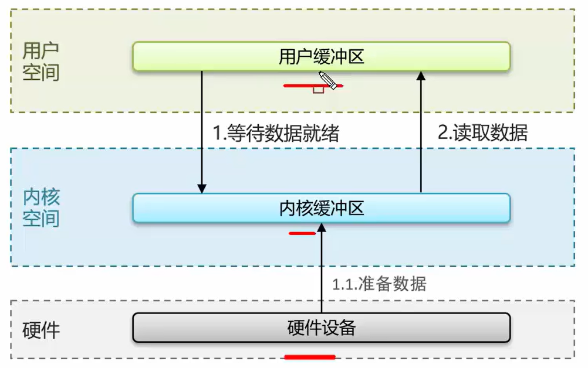
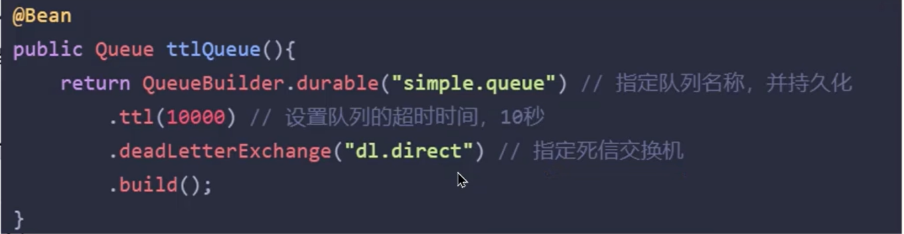

# 面试技术篇

# Redis

​	主要分为两种情况：使用场景和其他面试题。

### 使用场景

​	主要分为：**缓存**、**分布式锁**、计数器、保存token、消息队列、延迟队列。

* 缓存：穿透、击穿、雪崩、双写一致、持久化、数据过期、淘汰策略。
* 分布式锁：setnx、redisson（底层实现原理）
* 计数器：incrby命令

* 数据类型：保存token（String）、消息队列（list）、延迟队列（Zset）

**举例**

* redis的数据持久化策略有哪些
* 什么是缓存穿透，怎么解决
* 什么是布隆过滤器
* 什么是缓存击穿，怎么解决
* 什么是缓存雪崩，怎么解决
* redis双写问题
* redis分布式锁如何实现
* redis实现分布式锁如何合理的控制锁的有效时长
* redis的数据过期策略有哪些
* redis的数据淘汰策略有哪些

### 其他面试题

​	主要分为：集群、事务、Redis为什么快？

* 集群：主从、哨兵、集群
* 事务
* redis为什么快

**举例**

* Redis集群有哪些方案，知道嘛
* 什么是Redis主从同步
* 你们使用Redis是单点还是集群？Redis分片集群中，数据是怎么存储和读取redis集群
* 怎么保证redis的高并发高可用
* 你们用过Redis的事务吗？事务的命令有哪些？
* Redis是单线程的，但是为什么还那么快？
* redis主从数据同步的流程是什么？
* Redis集群脑裂该怎么解决？

## 缓存

### 正常缓存流程

* 根据搜索条件查询，先对redis进行查询，查询到了返回数据。
* redis查询不到，对DB进行查询，将数据返回给redis进行保存，再将结果返回。

### 缓存穿透

​	原因：查询一个不存在的数据，mysql查询不到数据，也不会直接写入缓存，就会导致每次请求都查数据库，如果请求的量足够大，就会击垮数据库，导致宕机。

* 解决方案1：缓存空数据，查询返回的数据为空，仍把这个结果塞到缓存。（KEY:1,VALUE:NULL）
  * 优点：简单，方便
  * 缺点：消耗内存（如果对方的攻击是很多种key的），可能会发生不一致的问题（原本为null，后面真的存入了该数据，就导致不一致的问题）。

* 解决方法2：布隆过滤器
  * 一开始预热数据库数据到redis时，同时预热布隆过滤器。

#### 布隆过滤器

​	布隆过滤器实现依赖于bitmap（位图），相当于是一个以bit位为单位的数组，数组中每个单元只能存储二进制0或者1。

* 布隆过滤器作用：布隆过滤器可以用于检索一个元素是否在一个集合中。
* 存储数据：id为1的数据，通过多个hash函数获取hash值，根据hash计算对应位置改为1
* 查询数据：使用相同hash函数，获取hash值，判断对应位置是否都为1，都为1说明是同一个key。

**误判情况**

* id为1的数据，hash结果为：1，3，7。
* id为2的数据，hash结果为：9，12，14。
* id为3的数据，不存在，但hash结果为：3，9，12。布隆过滤器会以为存在。

误判率：数组越小误判率越大，数组越大误判率越低，但是同时带来更多的内存消耗。**

#### 设置误判率

​	误判率不可能不存在的，要么增加数组，要么增加误判率，一般设置在百分之五以内。

#### 布隆过滤器具体实现方案

* Redisson
* Guava

总结：什么是缓存穿透，怎么解决？

* 缓存穿透：查询一个不存在的数据，mysql查询不到数据也不会直接写入缓存，就会导致每次请求都落到数据库上。
* 解决方案一：缓存空数据
* 解决方案二：布隆过滤器

### 缓存击穿

​	给某一个key设置了过期时间，当key过期的时候，恰好这时间点对这个key有大量并发请求过来，这些并发请求可能瞬间把db压垮。

* 解决方案1：互斥锁（分布式锁）
  * 线程1：
    * 查询缓存，未命中
    * 获取互斥锁成功
    * 查询数据库重建缓存数据
    * 写入缓存
    * 释放锁
  * 线程2：
    * 查询缓存，未命中
    * 获取互斥锁失败
    * 再进行上面两步，直到线程1将数据写入到了缓存
  * 优点：保证数据的强一致性
  * 缺点：因为其他线程都在等待，性能差

* 解决方案2：逻辑过期（不设置过期时间）

  在存入缓存的时候，设置一个逻辑过期时间。

  * 线程1：
    * 查询缓存，发现逻辑时间已过期
    * 获取互斥锁成功
    * 开启新线程2（重点）
    * 返回过期数据
  * 线程2：
    * 查询数据重建缓存数据
    * 写入缓存，重置逻辑过期时间
    * 释放锁
  * 线程3：
    * 查询缓存，发现逻辑时间已过期
    * 获取互斥锁失败
    * 返回过期数据
  * 线程4：（此时线程2已经完成）
    * 命中缓存，缓存时间并没有过期
  * 优点：高可用（不管结果一不一致，先返回了再说），性能优。
  * 缺点：一致性不强。

* 方法总结：两种方案各有好坏，要根据场景使用，比如：
  * 跟钱有关的业务，通常需要保持强一致性，使用第一种方式。
  * 比较注重用户体验的业务，就需要尽量保持高可用和性能优，使用第二种方式。

总结：

* 缓存击穿：给某一个key设置了过期时间，当key过期的时候，恰好这时间点，这个key有大量并发请求过来，这些并发请求可能瞬间把数据库压垮。
  * 方案1：互斥锁，强一致性，性能差
  * 方案2：逻辑过期，高可用，性能优，但无法保证数据的绝对一致性

### 缓存雪崩

​	缓存雪崩是指，在同一时间段，**大量的缓存key同时失效或者Redis服务宕机**，导致大量请求到达数据库，带来巨大压力。

#### 解决方案

* 给不同的Key设置随机的过期时间即可。（缓存大面积失效）
* 利用Redis集群提高服务的可用性，比如：哨兵模式、集群模式（Redis宕机）

* 给缓存业务添加降级限流策略，比如nginx、或者springcloud gateway
  * 降级策略可以作为系统的保底层略，适用于穿透、击穿、雪崩。
* 给业务添加多级缓存，比如Guava或Caffeine

### 三兄弟打油诗

### 双写一致

​	当修改了数据库的数据也要同时更新缓存的数据，缓存和数据要保持一致。

注：根据自己的业务判断回答一致性要求高还是允许延迟一致性。

#### 读数据流程

读操作：缓存命中，直接返回；缓存未命中查询数据库，写入缓存，设定超时时间。

写操作：延迟双删

#### 双写一致存在的问题

更新缓存分为：

* 先删除缓存--->修改数据库

  * 正常情况：数据初始为10，改为20
    * 线程1删除缓存10，修改数据库为20
    * 线程2查询缓存为空，查询数据库为20，更新缓存为20
  * 不正常情况：
    * 线程1删除缓存10
    * 线程2查询缓存为空，数据库查询为10，写入缓存为10
    * 线程1修改数据库为20

  出现了不一致的情况，这时候就需要再新增一次延迟删除缓存，即可同步。

* 先修改数据库--->删除缓存
  * 正常情况：
    * 线程2修改数据库为20，删除缓存10
    * 线程1查询缓存为空，查询数据库为20，写入缓存为20
  * 不正常情况1：此时缓存还没过期（这种情况是允许的）
    * 线程1：查询redis缓存，此时未过期，查询数据为10
    * 线程2：修改数据库为20，删除缓存。
  * 不正常情况2：此时缓存过期
    * 线程1：查询redis缓存为空，查询数据库为10
    * 线程2：修改数据库数据为20，删除缓存
    * 线程1：写入缓存10

#### 为什么要删除两次缓存？

​	当先修改数据库--->删除缓存出现数据库和缓存不一致的情况时，再延迟删除一次缓存，可以保证数据库和缓存的数据一致。

#### 为什么要延迟删除？（延迟一致性）

​	因为一般情况下，数据库是主从模式，是读写分离的，需要延时一会，让主机点把数据同步到从节点。 但是，延时多长时间，不好控制，所以说，延时极大程度的控制了脏数据的风险，但也只是控制了一部分。

**延迟双删**

优点：性能极高

缺点：还是有脏数据的风险，做不到强一致性

#### 分布式锁（读多写少）

​	强一致性，适用于和钱有关的金融业务，并且读多写少。

共享锁:读锁readLock，加锁之后，其他线程可以共享读操作

排他锁:独占锁writeLock，加锁之后，阻塞其他线程读写操作

* 线程1：加写锁，写数据，删除缓存，释放锁
* 线程2：加读锁，读缓存未命中，读数据库，解锁

具体代码实现：Redisson

* 读操作：

写操作：两个常量值需要一致（ITEM_READ_WRITE_LOCK）

优点：强一致性

缺点：性能低

一致性要求高：使用分布式锁（性能低）

允许延迟一致：

* 异步通知保证数据的最终一致性

* 基于Cannal的异步通知
  * 好处：对于业务代码几乎0侵入

#### 面试问题

redis作为缓存，mysql的数据如何与redis进行同步？

* 介绍自己简历上的业务，我们当时是把文章的热点数据存入到缓存中，虽然是热点数据，但是实时要求性没有那么高，所以我们当时采用的是异步的方案同步数据。（高可用）
* 我们当时是把抢券的库存存入到了缓存中，这个需要实时进行数据同步，为了保证数据的强一致性，我们当时采用的是redisson提供的读写锁来保证数据的同步。（强一致性）

那你来介绍一下异步的方案

* 允许延时一致的业务，采用异步通知。
  * 使用MQ中间件，更新数据之后，通知缓存删除
  * 利用cannal中间件，不需要修改业务代码，伪装为mysql的一个从节点，canal通过读取binlog数据更新缓存

* 强一致性的，采用Redisson提供的读写锁
  * 共享锁：读锁readLock，加锁之后，其他线程可以共享读操作
  * 排他锁：独占锁writeLock，加锁之后，阻塞其他线程的读写操作。

### Redis持久化

redis作为缓存，数据的持久化是怎么做的？

* RDB(Redis database Backup file)：也叫Redis数据快照。
* AOF(Append Only File)：追加文件。

#### RDB实现持久化

​	简单来说就是把内存中的所有数据都记录到磁盘中。当Redis实例故障重启后，从磁盘读取快照文件，恢复数据。

* 人工操作：使用redis客户端执行命令
  * 一般使用bgsave命令

* Redis内部触发RDB机制：
  * 可以在redis.conf文件中找到，格式如下：

#### RDB执行原理？

​	bgsave开始时会fork主进程得到子进程，子进程共享主进程的内存数据。完成fork后读取内存数据并写入 RDB 文件。

* fork操作采用的是copy-on-write技术：
  * 当主进程执行读操作时，访问共享内存
  * 当主进程执行写操作时，则会拷贝一份数据，执行写操作

#### AOF

​	Redis处理的每一个写命令都会记录在AOF文件，可以看做是命令日志文件。

注：AOF默认是关闭的，我们要通过配置去开启。

* 开启AOF操作

* 配置记录频率

*  控制文件大小

​	因为是记录命令，AOF文件会比RDB文件大的多。而且AOF会记录对同一个key的多次写操作，但只有最后一次写操作才有意义。通过执行bgrewriteaof命令，可以让AOF文件执行重写功能，用最少的命令达到相同效果。

​	Redis也会在触发阈值时，自动去重写AOF文件。阈值可以在redis.conf中配置：

#### RDB和AOF对比

​	RDB和AOF各有自己的优缺点，如果对数据安全性要求较高，在实际开发中往往会结合两者来使用。

## 分布式锁

redis分布式锁，是如何实现的？

需要结合项目种的业务进行回答，通常情况下，分布式锁使用场景：

* 集群情况下的定时任务
* 集群情况下的抢单
* 集群情况下的幂等性场景

#### 抢券场景

* 过程：

* 代码如下：

正常抢卷执行流程：

* 线程1：
  * 查询优惠券
  * 库存是否充足：是，扣减库存。否，抛出异常。
* 线程2：
  * 查询优惠券
  * 库存是否充足：是，扣减库存。否，抛出异常。

非正常情况：

* 线程1：
  * 查询优惠券剩余1
* 线程2：
  * 查询优惠券剩余1

* 线程1：
  * 优惠券充足，扣除为0

* 线程2：
  * 优惠券充足，扣除为0

单体项目：可以只加线程锁即可

* 线程1：
  * 获取互斥锁成功
  * 查询优惠券
  * 库存是否充足
  * 释放锁
* 线程2：
  * 获取互斥锁失败
  * 轮询等待线程1释放锁
  * 查询优惠券
  * 库存是否充足
  * 释放锁

服务集群部署：

分布式锁解决：

* 集群机器1
  * 线程1：
    * 获取分布式锁成功
    * 查询优惠券
    * 库存是否充足
    * 释放锁
  * 线程2：
    * 获取分布式锁失败
    * 。。。

* 集群机器2
  * 线程1：
    * 获取分布式锁失败
    * 一直轮询获取，直到获取到分布式锁
    * 查询优惠券
    * 库存是否充足
    * 释放锁
  * 线程2：
    * 获取分布式锁失败
    * 。。。

### 分布式锁—实现原理

Redis实现分布式锁主要利用Redis的setnx命令。setnx是SET if not exists（如果不存在，则SET）的简写。

* 获取锁：

  * key值：lock
  * value值：value
  * NX标识：NX（互斥）
  * EX表示超时时间：EX

  注：

  * 为什么不先设置锁，再设置过期时间。因为这是两条命令，无法保证原子性。
  * 可以不设置过期时间吗？不行，会导致死锁。

* 释放锁：

  * DEL：删除即可

  

* 整理流程
  * 如果刚好获取锁的业务宕机了，这时候过期时间就派的上用场了

####  如何合理设置锁的有效时间？

* 根据业务执行时间预估
  * 问题：可能出现卡顿、网络抖动这些现象都会导致业务执行变慢，锁提前释放。
* 给锁续期
  * 专门开一个线程监听业务执行，如果没执行完就给锁续期。

#### redisson实现分布式锁—执行流程

* 流程图
  * 线程1：
    * 当线程1进行加锁成功后，另开一个线程进行监控（一般称为看门狗，watch dog，时间为releaseTime/3，releaseTime默认30秒）每隔10秒做一次续期的操作
    * 当手动释放锁（到redis里将key删除），需要通知对应线程的watch dog，不需要再做监听了。因为这个key已经被删除了。  
  * 线程2：
    * 线程2加锁，若加锁成功，则流程和线程1一致。
    * 线程2加锁，加锁失败，则会进行while循环，不断尝试加锁。（通常情况下，业务执行非常快，一般不会等待太久）

* 代码示例：

  * lock.tryLock(10,timeUnit.SECONDS);
    * 10:代表的意思是while循环获取锁的最大等待时间
    * timeUnit.SECONDS：等待的单位
  * lock.tryLock(10,30,timeUnit.SECONDS);
    * 10:代表的意思是while循环获取锁的最大等待时间
    * 30:当前这个锁的失效时间。（当我们设置了锁的失效时间，看门狗就会消失，也就是没有锁续期功能）如果传的是-1或者是不传值，仍旧有看门狗。
    * timeUnit.SECONDS：等待的单位

  所有的加锁、设置过期时间等操作都是基于lua脚本完成。lua脚本最大的好处就是：能够调用redis命令，来保证多条命令执行的原子性。

#### redisson实现的分布式锁-可重入

​	**redis创建的锁是不可重入的，redisson实现的锁是可重入的。**

* 实现的底层原理：根据线程id判断是否为同一个线程，如果是同一个线程则可以获取锁（这个方法和reenttrantlock是一样的）
* 可重入锁的好处：
  * 当业务比较复杂的时候，锁的粒度需求比较细的时候，就可以用到。
  * 可以避免多个锁之间，产生死锁的问题。

* 可重入锁实现逻辑：
  * 利用hash结构记录线程id和重入次数

例如：

* 执行代码中的add1获取锁的时候

* 执行代码add1的add2的时候

* 当代码的add2执行unlock时

* 当代码add1执行unlock方法时，这时候就可以删除这个锁了

#### redisson实现的分布式锁—主从一致

* 当java应用去获取锁的时候，redis主机宕机了，此时选举出一个新节点作为主机

* 此时第二个java应用去第二个主机上申请锁，通过了。

  **此时两个应用同时获取到了同一把锁，锁的互斥性就没了，此时就推出了红锁。**

**RedLock（红锁）**

​	不能只在一个redis实例上创建锁，应该是在多个redis实例上创建锁【（n/2）+1】，向下取整，超过redis节点的一半才行，避免在一个redis实例上加锁。

* 红锁缺陷：
  * 实现复杂
  * 性能差：因为需要提供多个独立的redis节点
  * 运维繁琐

redis官方也不推荐使用红锁来解决主从不一致的问题。

**分析问题**

* 哪台机器天天挂，所以这其实是一种低概率事件。
* redis整体思想遵从AP原则，就是高可用原性，我们可以做到最终一致性就好。
* 如果真的想要保证过程中也保证一致性：建议采用CP思想的zookeeper来实现分布式锁，它可以实现数据的**强一致性**

#### 总结

Redis分布式锁，是如何实现的？

* 先按简历上的业务进行描述分布式锁使用场景
* 我们当使用redisson实现的分布式锁，底层是setnx和lua脚本（保证原子性）

Redisson实现分布式锁如何合理的控制锁的有效时长？

* 在redisson的分布式锁中，提供了一个WatchDog（看门狗），一个线程获取锁以后，WatchDog会给持有锁的线程续期（默认是10秒一次）

Redisson这个锁，可以重入吗？

* redis不可以重入，但是redisson的锁是可以重入的。
* 底层就是判断是否是当前线程，在redis中存储结构使用的是hash结构，存储线程信息和重入次数。

Redisson锁能解决主从数据一致的问题吗？

* 不能解决，但是可以用redisson提供的红锁来解决，但是这样的话，红锁需要多个节点持有锁，性能太差了，如果非要业务中保证强一致性，建议使用zookeeper来实现分布式锁。

### 其他面试题

redis集群有哪些方案，知道嘛？

* 主从复制
* 哨兵模式
* 分片集群

#### 主从复制

* 单节点Redis：并发能力是有上限的，要进一步提高Redis的并发能力，就需要搭建主从集群，实现读写分离。
* redis主从节点：使用一台主Redis进行写操作，两台进行读操作读操作。这时候，如果原本的读并发为10万，此时2台读操作的节点，就可以将并发提高到20万。

**主从全量同步：**

* slave：
  * 执行replicaof命令，执行连接
  * 请求数据同步replid、offset
* master：
  * 判断是否是第一次同步：replid是否一致
    * 是，返回master的数据版本信息，replid、offset
    * 不是，返回repl_baklog中的offset差值的命令
* slave：
  * 保存版本信息

* master：
  * 执行bgsave，生成RDB
  * 发送RDB文件
* slave：清空本地数据，加载RDB文件。

在执行发送RDB文件的时候，如果主节点又写入了文件，则将新建一个repl_baklog文件，用来记录其他RDB文件。发送给从几点

slave：

* 执行接收到的命令

**主从增量同步：**

* slave：重启
  * 请求同步，携带replid、offset

* master：判断请求replid是否一致
  * 不一致，回复continue
  * 去repl_baklog中获取offset后的数据
  * 发送offset后的命令
* slave：执行命令

#### 总结

介绍一下redis的主从同步

* 单节点Redis的并发能力是有上限的，要进一步提高redis的并发能力，就需要搭建主从集群，实现读写分离。一般是一主多从，主节点负责写数据，从节点负责读数据。

能说一下，主从同步数据的流程

* 全量同步：
  * 从节点请求主节点同步数据
  * 主节点判断是否是第一次请求，是第一次就与从节点同步版本信息(replication id和offset)
  * 主节点执行bgsave，生成rdb文件后，发送给从节点去执行
  * 在rdb生成执行期间，主节点会以命令的方式记录到缓冲区(一个日志文件)
  * 把生成之后的命令日志文件发送给从节点进行同步
* 增量同步：
  * 从节点请求主节点同步数据，主节点判断是不是第一次请求，不是第一次就获取从节点的offset值。
  * 主节点从命令日志种获取offset值之后的数据，发送给从节点进行数据同步。

#### 哨兵模式

Redis提供了哨兵（Sentinel）机制来实现主从集群的自动故障恢复。哨兵的结构和作用如下：

* 监控：Sentinel会不断检查您的master和slave是否按预期工作。
* 自动故障恢复：如果master故障，Sentinel会将一个slave提升为master。当故障实例恢复后也以新的master为主。
* 通知：Sentinel充当Redis客户端的服务发现来源，当集群发生故障转移时，会将最新信息推送给Redis的客户端。

##### 服务状态监控

​	Sentinel基于心跳机制检测服务状态，每隔1秒向集群的每个实例发送ping命令：

* 主观下线：如果某sentinel节点发现某实例未在规定时间响应，则认为该实例**主观下线**。
* 客观下线：若超过指定数量（quorum）的sentinel都认为该实例主观下线，则该实例**客观下线**。quorum值最好超过Sentinel实例数量的一半。
  * 可以通过redis.config修改

##### 哨兵选主规则

* 首先判断主与从节点断开时间长短，如超过指定值就排除该从节点

* 然后判断该从节点的slave-priority值，越小优先级越高
* 如果slave-prority一样，则判断slave节点的offset值，越大优先级越高（较为重要）
* 最后是判断slave节点的运行id大小，越小优先级越高（比较无所谓）

##### 哨兵模式脑裂问题

​	由于网络原因，主节点和Sentinel都处于不同的分区，哨兵Sentinel只能检测从节点，因而选举一个slave成为新的master节点。但此时，老的主节点还没有挂，客户端还能够正常连接，**所以客户端会持续的对老的master写入数据。**假如此时网络恢复了，此时哨兵会将老的master降为slave，此时slave会清空先前的数据，去同步新master的数据。**但先前老master读入的数据就丢失了。**此时客户端就连接的是新master了。

* 解决方法：
  * 设置写入的主节点最少要有一个从节点：min-replicas-to-write 1
    * 意义：防止脑裂过程中，老主机没有从节点，还对他进行写入
  * 表示数据复制和同步的延迟不能超过5秒：min-replicas-max-lag 5
    * 意义：因为脑裂了，所以连接不到从节点，所以会一直无法同步和复制。

##### 总结

* 怎么保证Redis的高并发高可用
  * 哨兵模式：实现主从集群的自动故障恢复（监控、自动故障恢复、通知）
* 你们使用的redis是单点还是集群，哪种集群？
  * 主从：1主1从+哨兵就可以了。单节点不超过10g内存，如果redis内存不足则可以给不同服务分配独立redis主从节点。
* redis集群脑裂，该怎么解决？
  * 集群脑裂是由于主节点和从节点和sentinel处于不同的网络分区，使得sentinel没有能够心跳感知到主节点，所以通过选举了一个从节点为主，这样就存在了两个master，就像大脑分裂一样。这样会导致客户端还在老的主节点那里写入数据，新节点无法同步数据，当网络恢复后，sentinel会将老的主节点降为从节点，这时再从新master同步数据，就会导致数据丢失。
  * 解决：我们可以修改redis配置，可以设置最少的从节点数量，以及缩短主从数据同步的延迟时间，达不到要求就拒绝请求，可以避免大量数据丢失。

#### 分片集群结构

​	主从模式可以解决**高并发读**问题、哨兵可以解决**高可用**问题。但是已然有两个问题没有解决：

* 海量数据存储问题
* 高并发写的问题

​	使用分片集群可以解决上述问题，分片集群特征：

* 集群中有多个master，每个master保存不同数据。（如果每个master可以存储20g不同数据，3个master就可以存储60g内存，理论上master越多，可以存储的数据越多。有多个master可以写，所以并发写问题也解决了。）
* 每个master都可以有多个slave节点
* master之间通过ping监测彼此健康状态（不需要哨兵，如果多个master认为这个master下线，那么也可以认为他客观下线）
* 客户端请求可以访问集群任意节点，最终都会被转发到正确节点。

##### 数据读写

​	Redis分片集群引入了哈希槽的概念，Redis集群有16384个哈希槽，每个key通过CRC16校验后对16384取模来决定放置哪个槽，集群的每个节点负责一部分hash槽。

##### 总结

redis的分片集群有什么作用？

* 集群中有多个master，每个master保存不同数据（解决海量存储，高并发写的问题）
* 每个master可以有多个slave节点（解决高并发读的问题）
* master之间通过ping监测彼此健康状态（解决监控的问题）
* 客户端请求可以访问集群任意节点，最终都会被转发到正确的节点（路由规则）

redis分片集群中数据是怎么存储和读取的？

* Redis分片集群引入了哈希槽的概念，Redis集群有16384个哈希槽
* 将16384个插槽分配到不同的实例
* 读写数据：根据key的有效部分计算哈希值，对16384取余（有效部分，如果key前面有大括号，大括号部分内容就是有效部分，如果没有，则以key本身作为有效部分）余数作为插槽，寻找插槽所在实例。

#### Redis快的原因

redis是单线程的，但是为什么还那么快？

* Redis是纯内存操作，执行速度非常快
* 采用单线程，避免了不必要的上下文切换可竞争条件，多线程还要考虑线程安全问题。
* 使用I/O多路复用模型，非阻塞IO

能解释一下I/O多路复用模型？

​	因为redis是纯内存操作，执行速度非常快，它的性能瓶颈是**网络延迟**而不是执行速度，I/O多路复用模型主要就是实现了高效的网络请求。

* 用户空间和内核空间。
* 常见的IO模型
  * 阻塞IO(Blocking IO)
  * 非阻塞IO（Nonblocking IO）
  * IO多路复用（IO Mutiplexing）

* Redis网络模型

##### 用户空间和内核空间

* Linux系统中一个进程使用内存情况划分两部分：内核空间、用户空间。
* **用户空间**：只能执行受限的命令（Ring3），而且不能直接调用系统资源，必须通过内核提供的接口来访问。
* **内核空间**：可以执行特权命令（Ring），调用一切系统资源。

Linux系统为了提高IO效率，会在用户空间和内核空间加入缓冲区：

* 写数据时：要把用户缓冲数据拷贝到内核缓冲区，然后写入设备。
* 读数据时：要从设备读取数据到内核缓冲区，然后拷贝到用户缓冲区。 

影响效率的有两个原因：

* 假如内核缓冲区没有数据，用户缓冲区就会一直等待数据。
* 数据的拷贝，我们读数据的时候，需要从内核缓冲区拷贝到用户缓冲区，写数据的时候用户缓冲区拷贝到内核缓冲区，这种来回的拷贝是非常影响性能的。

#### 阻塞IO

顾名思义，阻塞IO就是两个阶段都必须阻塞等待：

* 阶段一：
  * 用户进程尝试读取数据（比如网卡数据）
  * 此时数据尚未到达，内核需要等待数据
  * 此时用户进程也处于阻塞状态
* 阶段二：
  * 数据到达并拷贝到内核缓冲区，代表已就绪
  * 将内核数据拷贝到用户缓冲区
  * 拷贝过程中，用户进程依然阻塞等待
  * 拷贝完成，用户进程接触阻塞，处理数据

可以看到，阻塞IO模型中，用户进程在两个阶段都是阻塞状态。

#### 非阻塞IO

​	顾名思义，非阻塞IO的recvfrom操作会立即返回结果而不是阻塞用户进程。

* 阶段一：
  * 用户进程尝试读取数据（比如网卡数据）
  * 此时数据尚未到达，内核需要等待数据
  * 返回异常给用户进程
  * 用户进程拿到error后，再次尝试
  * 循环往复，直到数据就绪
* 阶段二：
  * 将内核数据拷贝到用户缓冲区
  * 拷贝过程中，用户进程依然阻塞等待
  * 拷贝完成，用户进程解除阻塞，处理数据

​	可以看到，非阻塞IO模型中，用户进程在第一个阶段是非阻塞，第二个阶段是阻塞阶段。虽然是非阻塞，但性能没有得到提高。而且忙等机制会导致cpu空转，cpu使用率暴增。

#### IO多路复用

​	IO多路复用：是利用单个线程来同时监听多个Socket，并在某个Socket可读，可写时得到通知，从而避免无效的等待，充分利用cpu资源。

* 阶段一
  * 用户进程调用select，指定要监听的Socket集合
  * 内核监听对应的多个socket
  * 任意一个或多个socket数据就绪则返回readable
  * 此过程中用户进程阻塞
* 阶段二
  * 用户进程找到就绪的socket
  * 依次调用recvfrom读取数据
  * 内核将数据拷贝到用户空间
  * 用户进程处理数据

#### IO多路复用案例

​	linux提供的IO多路复用是利用单个线程来同时监听多个Socket，并在某个Socket可读、可写时得到通知，从而避免无效的等待，充分利用cpu资源。不过监听Socket的方式、通知的方式又有多种实现，常见的有：

* select的实现方案：
  * 监听socket，如果socket返回了readable，说明数据到达。
  * 但此时并不能知道是哪个socket返回的，所以需要进行遍历。
  * 遍历出对应的socket后，再进行recvfrom操作，复制到用户缓冲区。

* poll的实现方案：
  * 监听socket，如果socket返回readable。
  * 但此时并不能知道是哪个socket返回的，所以需要进行遍历。
  * 遍历出对应的socket后，再进行recvfrom操作，复制到用户缓冲区。

* epoll的实现方案
  * 会在通知用户进程Socket就绪的同时，把已就绪的Socket写入用户空间（不需要遍历）

* 三者差异：
  * select和poll只会通知用户进程有Socket就绪，但不确定具体是哪个Socket，需要用户进程逐个遍历Socket来确认。
  * epoll则会在通知用户进程Socket就绪的同时，把已就绪的Socket写入用户空间。

#### Redis网络模型

​	Redis通过IO多路复用来提高网络性能，并且支持各种不同的多路复用实现，并且将这些实现进行封装，提供了统一的高性能数据库。

* 很多socket请求到redis
* 当socket处于就绪状态，redis的多路复用会将他们的事件派发到三个处理器上
  * 连接应答处理器：建立连接的
  * 命令回复处理器：用于对redis请求执行完毕的缓冲区进行回复。
  * 命令请求处理器：进行redis缓存存入操作的处理器。
    * 接受请求数据
    * 将数据转换成reids命令
    * 选择并执行redis命令，将结果写入缓冲队列
    * 缓冲区通知命令回复处理器

​	最影响操作性能的永远都是IO，比如数据库的磁盘读写就是最明显的一环。

在redis6.0之后，又引入了多线程的模型，就是想进一步提升redis的性能（解决网络读写）。

##### 多线程的redis模型（改善网络IO）

* 接受网络请求，指令转换改为多线程。（涉及到网络响应问题）（执行命令和结果写入是串行的压力不大）
* 命令回复处理器：也会涉及到网络响应问题。

主要是减少了，网络IO对于处理变慢的影响。

#### 总结

能结实一下IO多路复用模型？

* IO多路复用：是指利用单个线程来同时监听多个Socket，并在某个Socket可读，可写时得到通知，从而避免无效等待，充分利用cpu资源。目前的IO多路复用都是采用的epoll模式，它会在通知用户进程Socket就绪的同时，把已就绪的Socket写入用户空间，不需要挨个遍历Socket来判断是否就绪，提升性能。
* Redis网络模型
  * 就是使用I/O多路复用结合事件的处理器来应对多个Socket请求
    * 连接应答处理器
    * 命令回复处理器，在Redis6.0之后，为了提升更好的性能，使用了多线程来处理回复事件
    * 命令请求处理器，在Redis6.0之后，将命令的转换使用了多线程，增加命令转换速度，在命令执行的时候，依然是单线程

# SQL

## 慢查询

* 聚合查询
* 多表查询
* 表数据量过大查询
* 深度分页查询

表象：页面加载过慢、接口压测响应时间过长（超过1s）

### 如何定位慢查询

* 介绍一下当时生产问题的场景（我们当时的一个接口测试非常慢，压测结果大概是5秒）
* 我们系统中当时查询采用了运维工具（SkyWalking），可以检测出哪个接口，最终是sql的问题。
* 在mysql种开启慢查询日志，我们设置的值就是2秒，一旦sql执行超过2秒就会记录到日志中（调试阶段）

### 如何分析慢查询

#### 执行慢的sql特点：

* 聚合查询：新增一个临时表解决
* 多表查询：优化sql语句结构
* 表数据量过大查询：添加索引
* 深度分页查询

#### 一个SQL执行很慢，如何分析？

* 可以采用EXPLAIN或者DESC命令获取MySQL是如何执行的SELECT信息。

* 使用后会得到具体信息：

  * possible_keys：当前sql可能会使用到的索引
  * key：实际命中的索引
  * key_len：索引占用的大小
  * Extra：额外的优化建议，如下图
  * type：这条sql的连接类型，性能由好到差为NULL、system、const、eq_ref、range、index、all
    * NULL：没有查询到表
    * system：查询系统中的表
    * const：根据主键查询
    * eq_ref：主键索引查询或唯一索引查询
    * ref：索引查询
    * range：范围查询（有走索引，但是范围查询）（最低要求）
    * index：索引树扫描（全索引查询）
    * all：全盘扫描

  通过key和key_len来查看是否可能会命中索引。

  

总结：

SQL语句执行很慢，如何分析？

* 可以采用mysql自带的分析工具EXPLAIN
  * 通过key和key_len检查是否命中索引（索引本身存在是否失效的情况）
  * 通过type字段查看sql是否有进一步优化的空间，是否存在全索引或者全盘扫描。
  * 通过extra建议判断，是否出现了回表的情况，如果出现了，可以尝试添加索引或修改返回字段来修复。

## 索引

### 什么是索引？

* 索引是帮助Mysql高效获取数据的一种数据结构
* 索引可以提高检索效率，降低数据库IO成本
* 通过索引列对数据进行排序，降低数据排序的成本，降低cpu的消耗

### 索引底层数据结构了解吗？

MySQL的innoDB引擎采用了B+树的数据结构来存储索引：

* 阶数更多，路径更短
* 磁盘读写代价B+树更低，非叶子节点只存储指针，叶子节点存储数据
* B+树便于扫库和范围查找，叶子节点是一个双向链表

### 什么是聚簇索引，什么是非聚簇索引？

* 聚簇索引：将数据存储与索引放到了一块，索引结构的叶子节点保存了行数据（整行数据）。
  * 特点：必须有，而且只有一个

* 非聚簇索引（二级索引）：将数据与索引分开存储，索引结构的叶子节点关联的是对应的主键（主键值）。
  * 特点：可以存在多个，且非聚簇索引是需要拿到主键值回表查询的
  * 例如下图，对name建立二级索引，叶子节点存储的是主键值。

#### 聚集索引（聚簇索引）选举规则：

* 如果存在主键，主键索引就是聚集索引。
* 如果不存在主键，将使用第一个唯一（UNIQUE）索引作为聚集索引。
* 如果表没有主键，也没有合适的唯一索引，则Innodb会自动生成一个rowid作为隐藏的聚集索引。

#### 回表查询

​	主键是id，二级索引是name，sql语句是“select * from user where name =‘Arm’； ”整个查询过程如下：

* 先根据二级索引name，查询到对应Arm的对应主键值
* 然后使用主键值，回到主键索引的树里进行二次查询出Arm的所有数据

### 什么是覆盖索引？

​	覆盖索引是指查询使用了索引，并且需要返回的列，在该索引中已经全部能够找到。（不需要回表查询）

具体举例：

* 虽然是二级索引，但所需的列，不需要回表查询，所以是覆盖索引

* 所需的列有gender，需要回表再次查询，所以不是覆盖索引

### MYSQL超大分页处理（深分页）

​	在数据量较大时，如果使用limit分页查询，在查询时，越往后分页查询效率越低。

#### 为什么差距这么大？

* 因为，当在进行分页查询时，如果执行limit 9000000,10，此时需要MySQL排序前9000010 记录，仅仅返回9000000-9000010的记录，其他记录丢弃，查询排序的代价非常大。

#### 优化思路

​	一般分页查询时，通过创建**覆盖索引**能够比较好地提高性能，可以通过**覆盖索引**加**子查询**形式进行优化。

* 子查询select id from tb_sku order by id limit 900000,10：覆盖索引，先查出来id，然后通过id再次进行查询，速度会加快很多

#### 总结：

什么是覆盖索引？

* 覆盖索引是指查询使用了索引，并且需要返回的列，在该索引中已经全部能够找到。（索引可以带有主键，但一定不需要回表查询）

MYSQL超大分页怎么处理？

* 解决方案：覆盖索引+子查询
  * 我们先分页查询获取表中的id，并且对表中的id进行排序，就能筛选出我们表中id的集合，因为id 是覆盖索引，所以我们操作id的时候，效率会相对的比较高。
  * 最后再通过id集合，去到原本的表中进行关联查询，效率就可以得到提升。

### 索引创建的原则有哪些？

* 数据量较大，且查询比较频繁的表建立索引。（单表超过10万数据，增加用户体验）（重要！）
* 针对常作为查询条件（where）、排序（order by）、分组（group by）操作的字段建立索引。（重要！）

* 尽量选择区分度高的列作为索引，尽量建立唯一索引，区分度高，使用索引效率越高。
* 尽量使用联合索引，减少单列索引，查询时，联合索引很多时候可以覆盖索引，节省存储空间，避免回表，提高查询效率。（重要！）
* 要控制索引的数量，索引并不是多多益善，索引越多，维护索引结构的代价越大，会影响增删改查效率。（重要！）
* 如果索引列不能存储NULL值，请在创建时用NOT NULL约束它。

#### 总结

* 数据量较大，且查询比较频繁的表（重要！）
* 常作为查询条件、排序、分组的字段（重要！）
* 字段内容区分度高
* 内容较长，使用前缀索引
* 尽量联合索引（重要！）
* 要控制索引的数量（重要！）
* 如果索引列不能存储NULL值，请在创建表时使用NOT NULL约束它

### 索引失效

​	举例：我在接手数据驾驶舱项目的时候，发现原项目的时间范围都是使用的between作为查询条件进行查询，我多次测试的情况下，发现在数据量大，但查询数据量小的情况下，它是会走索引的，因为回表查询的消耗很小。但当查询数据量大，查询数据量也大的情况下，回表的消耗也大，它不会走索引。针对这个情况，我就将between改为了>=和<=，这时候不论什么情况，都会走索引，并且效率也得到了提升。

#### 索引失效的情况

先建立一个联合索引：

* 情况1：违反最左前缀法则

  * 如果索引了多列，要遵守最左前缀法则。指的是，查询从索引最左列开始，并且不跳过索引中的列。匹配最左前缀法则，走索引。

    * 不会失效的情况：

    

    * 失效的情况：违反最左前缀法则，索引失效

    

    * 符合了一条，但跳跃了一条，仅一条生效

    

* 情况2：范围查询右边的列，不能使用索引。
  * 根据前面两个字段name，status查询是走索引的，但是最后一个条件address没有用到索引。

* 情况3：不要在索引列上进行运算操作，否则索引也会失效。

* 情况4：字符串不加单引号，造成索引失效
  * 发生类型转换，造成索引失效

* 情况5：以%开头的like模糊查询，索引失效。如果仅仅是尾部模糊匹配，索引不会失效。如果是头部模糊匹配，索引失效。

### sql优化经验

* 表的设计优化：（如下）
* 索引优化：
  * 数据量较大，且查询比较频繁的表（重要！）
  * 常作为查询条件、排序、分组的字段（重要！）
  * 尽量联合索引（重要！）
  * 要控制索引的数量（重要！）
* sql语句优化：
  * 避免使用select * ，这样有可能使用覆盖索引，不需要回表查询
  * 避免索引失效
    * 违反最左前缀原则
    * 违反范围查询右边的列无法使用索引
    * 不要在索引列加上运算，否则索引会失效。
    * 模糊查询不要在前面加%号，但是可以在中间或者后面加，不会导致失效。
* 主从复制、读写分离：不让数据的写入，影响读操作
* 分库分表：一张表数据超过500万。（后续会加入）

 #### 表的设计优化

* 设置合适的数值（tinyint、int、bigint），根据实际情况选择
* 设置合适的字符串类型（char和varchar）char定长效率高，varchar可变长度，效率低

#### sql语句优化

* SELECT语句务必指明字段名称（避免直接使用select *）

* SQL语句要避免造成索引失效的写法

* 尽量使用union all代替union，union会多一次去重过滤，效率低

* 避免在where子句中对字段进行表达式操作

* Join优化 能用inner join 就不用left join，right join如必须使用 一定要以小表为驱动。内连接会对两个表进行优化，优先把小表放到外边把大表放到里边。left join 或 right join，不会重新调整顺序

  * 如下图：小表在前，mysql只需要3次连接，每次访问1000条。

  

  * 如果两个循环相反：大表在外，则需要1000次连接，每次连接访问3条。

#### 主从复制、读写分离

​	如果数据库的使用场景读的操作比较多的时候，为了避免写的操作所造成的性能影响 可以采用读写分离的架构。
​	读写分离解决的是，数据库的写入，影响了查询的效率

#### 分库分表

## 事务

​	事务是一组操作的集合，它是一个不可分割的工作单位，事务会把所有的操作作为一个整体一起向系统提交或撤销操作请求，即这些操作要么同时成功，要么同时失败。

### 事务特性是什么？（ACID）

* A（原子性、Atomic）：事务是不可分割的最小操作单元，要么全部成功，要么全部失败。
* C（一致性、consistency）：事务完成时，必须保证所有数据都是一致的。
* I（隔离性、isolation）：数据库系统提供隔离机制，保证事务在不受其他外部并发操作影响的独立环境下允许。
* D（持久性、durability）：事务一旦提交或回滚，它对数据库中的数据改变就是永久的。

对应图中：

* 原子性：A给B转钱，要么转钱成功，要么就转钱失败。
* 一致性：A给B转钱，A减少1000，B就必须增加1000。
* 隔离性：其他人的转账操作并不会影响到AB的转钱操作。
* 持久性：A和B转钱的过程都是落入磁盘的。

### 并发事务带来了哪些问题？

* 脏读：一个事务读到了另一个事务还没提交的数据。
* 不可重复读：一个事务先后进行了两次查询，查询的前后结果不一致。
* 幻读：一个事务查询数据时，发现没有对应的数据行。准备插入数据的时候，发现这行数据又存在了，好像出现了幻影一般。

### 怎么解决的这些问题？

​	Mysql设置了四个隔离级别：

* RU读未提交：三个问题都无法解决
* RC读以提交：可以用来解决脏读
* RR可重复读：可以用来解决脏读、不可重复读，是mysql默认级别。
* 串行化：都可以解决，但只能一个事务执行完了，再执行其他事务，失去了并发能力。

​	级别越高，安全性越高，但并发能力越低。

### undo log和redo log的区别？

* redo log：记录的是物理变化，服务器宕机可用来恢复数据，保证了事务的持久性。
* undo log：记录的是逻辑变化，所有正向操作的逆操作（比如insert，它记录的就是delete），用于事务的回滚，通过逆操作来恢复数据，保证了事务的原子性和一致性。

* redo log保证了事务的持久性，undo log保证了事务的原子性和一致性。

### 事务中的隔离性是如何保证的？

* 锁：排他锁（如一个事务获取了一个数据行的排他锁，其他事务就不能再获取该行的其他锁）
* MVCC：多版本并发控制。

### 解释一下MVCC?

​	多版本并发控制。指维护一个数据的多个版本，使得读写没有冲突。MVCC具体实现，主要依赖于数据库记录中的：

* 隐藏字段
  * trx_id(事务id)：每记录一次事务id，是自增的
  * roll_pointer(回滚指针)：指向上一个版本的事务版本记录地址
* undo log日志
  * 回滚日志：存储老版本数据
  * 版本链：多个事务并行操作记录某一行记录，记录不同事务修改数据的版本，通过roll_pointer指针形成一个链表
* readView
  * 根据readView的匹配规则和当前选择的事务级别，可以获取对应的快照度
    * RC事务隔离级别：每次查询都会形成新的快照（只能读到别的事务已经提交的结果）
    * RR事务隔离级别：每次查询读到的都是首次读到的快照读结果（保证事务内前后读到的一致）

### 主从同步原理？

* 结构图：

#### 同步原理

​	MySQL主从复制的**核心**就是二进制日志BINLOG。

​	二进制日志(BINLOG)：记录了所有的 **DDL(数据定义语言，create、alter、drop表操作)语句和 DML(数据操纵语言，insert、update、delete表操作)语句**，但不包括数据査询(SELECT、SHOW)语句。

​	主从复制分为以下三步：

* Master主库在事务提交时，会把数据变更记录在二进制日志文件Binlog中。
* 从库读取主库的二进制日志文件Binlog，写入到从库的中继日志Relay Log。

* 从库重做中继日志的事件，将改变反应到它自己的数据中。

### 分库分表

#### 分库分表的时机

* 前提，业务数据越来越多，或业务发展比较迅速。 单表的数据达1000万，或20G以后。
* 优化已解决不了性能问题。（主从读写分离，查询索引）
* IO瓶颈（磁盘IO、网络IO）、CPU瓶颈（聚合查询、连接数太多）

#### 拆分策略

* 垂直拆分
  * 垂直分库
  * 垂直分表
* 水平拆分
  * 水平分库
  * 水平分表

##### 垂直拆分

* 垂直分库：以表为依据，根据业务将不同表拆分到不同库中
* 垂直分库特点：
  * 按业务对数据分级管理、维护、监控、扩展
  * 在高并发下，提高磁盘IO和数据量连接数

* 垂直分表：以字段为依据，根据字段属性将不同字段拆分到不同表中。
* 拆分规则：
  * 把不常用的字段单独放一张表
  * 把text，blob等大字段拆分出来放在附表
* 特点：
  * 冷热数据分离
  * 减少IO过度争抢，两表不影响

虽然图片画的是两个数据库，但实际开发中，有可能是同一个数据库的两张表，并不一定是多个库。

##### 水平拆分

* 水平分库：将一个库的数据拆分到多个库中。
* 水平分库路由规则：
  * 根据id节点取模
  * 按id也就是范围路由，节点
* 特点：解决了单库大数据量，高并发的性能瓶颈问题。
* 提高了系统稳定性和可用性。

* 水平分表：将一个表的数据拆分到多个表中（可以在同一个库内）
* 水平分表路由规则：
  * 根据id节点取模
  * 按id也就是范围路由，节点

* 特点：
  * 优化单一表数据量过大而产生的性能问题；
  * 避免IO争夺并减少锁表的几率；

#### 新的问题和新的技术

分库之后的问题：

* 分布式事务一致性的问题
* 跨节点关联查询
* 跨节点分页、排序函数
* 主键避重

为了解决这些问题，主要会使用中间件：

* sharding-sphere
* mycat

#### 总结

* 业务介绍
  * 根据自己简历上的项目，想一个数据量较大业务(请求数多或业务累积大)
  * 达到了什么样的量级(单表1000万或超过20G)

* 具体拆分策略
  * 水平分库：将一个库的数据拆分到多个库中，解决海量数据存储和高并发的问题
  * 水平分表：解决单表存储和性能的问题
  * 垂直分表：根据业务进行拆分，高并发下提高磁盘IO和网络数据连接数
  * 垂直分库：冷热数据分离，多表互不影响

## RabbitMQ

RabbitMQ在项目中的作用：

* 异步发送（验证码、短信、邮件）
* MYSQL和Redis，ES之间的数据同步
* 分布式事务
* 削峰填谷

### 如何保证消息不丢失？

导致消息丢失的原因：

* 生产者发送消息未到达交换机或队列，解决方法：生产者确认机制
* MQ宕机，队列里消息丢失，解决方法：MQ持久化

* 消费者宕机导致消息丢失，

#### 生产者确认机制

​	RabbitMQ提供了publisher confirm机制来避免消息发送到MQ过程中丢失。消息发送到MQ以后，会返回一个结果给发送者，表示消息是否处理成功。

* 投递到交换机失败，返回nack publish-confirm
* 投递到队列失败，返回ack publish-return
* 成功到消费者，返回ack publish-confirm

​	

消息失败了之后如何处理？

* 回调方法即时重发
* 记录日志
* 保存到数据库然后定时重发，成功发送后即刻删除表中数据

### 消息持久化

​	MQ默认是内存存储消息，开启持久化功能可以确保缓存在MQ中消息不丢失。用以解决MQ宕机问题。

* 交换机持久化

* 队列持久化

* 消息持久化，SpringAMQP中的消息默认是持久化的，可以通过MessageProperties中的DeliveryMode来指定

### 消费者确认

RabbitMQ支持消费者确认机制，即:消费者处理消息后可以向MQ发送ack回执，MQ收到ack回执后才会删除该消息而SpringAMQP则允许配置三种确认模式:

* manual：手动ack，需要在业务代码结束后，调用api发送ack
* auto：自动ack，由spring检测listener代码是否出现异常，没有异常则返回ack；抛出异常则返回nack
* none：关闭ack，mq假定消费者获取消息后会成功处理，因此消息投递后立即被删除。

我们可以利用Spring的retry机制，在消费者出现异常时利用本地重试，设置重试次数，当次数达到了以后，如果消息依然失败将消息投递到异常交换机，交由人工处理。

### 总结

rabbitMQ如何保证消息不丢失？

* 开启生产者确认机制，确保生产者消息能到达队列。
  * 未到达交换机返回nack publish-confirm
  * 未到达消息队列返回ack publish-return
  * 到达消费者返回ack publish-confirm
* 开启持久化功能，确保消息未消费前在队列中不会丢失。
  * 交换机持久化
  * 队列持久化
  * 消息持久化
* 开启消费者确认机制为auto，由spring-retry确认消息处理成功后返回akc。
* 开启消费者失败重试机制，多次重试失败后将消息投递到异常交换机，交由人工处理。

### 消息重复消费问题如何解决？

导致问题的情况：

* 网络抖动：消费者收到了消息，但网络发生抖动导致队列没有收到确认消息。
* 消费者挂了：消费者得到了消息，但发送确认消息的时候挂了，这时候会再次触发消费者重试机制。

解决方案：

* 每条消息设置一个唯一id标识，建议采用。
  * 消费者接受到消息的时候，校验业务id是否存在（到表中或者是缓存中查询），如果不存在则接收消息，正常处理业务就可以了。如果id已经存在了，则证明消息不需要再去处理了。
* 幂等方案：分布式锁、数据库锁（悲观锁、乐观锁），不推荐，因为效率低下。

以上两个方法适用于所有的MQ，包括：

* Kafka
* RabbitMQ
* RocketMQ

### RabbitMQ中死信交换机？（RabbitMQ延迟队列有了解过吗？）

* 延迟队列：进入队列的消息会被延迟消费的队列。

* 场景：超时订单、限时优惠、定时发布。

  延迟队列=死信交换机+TTL（生存时间）

#### 死信交换机

​	当一个队列中的消息满足下列情况之一时，可以成为死信（dead letter）：

* 消费者使用basic.reject或basic.nack声明消费失败，并且消息request的参数设置为false
* 消息是一个过期消息，超时无人消费（超过了过期时间）
* 要投递的队列消息堆积满了，最早的消息可能成为死信

如果该队列配置了**dead-letter-exchange**属性，指定了一个交换机，那么队列中的死信就会投递到这个交换机当中，而这个交换机被称之为死信交换机（Dead Letter Exchange,简称DLX）

具体代码：

#### TTL

​	TTL，也就是Time-To-Live。如果一个队列中的消息TTL结束仍未消费，则会变为死信，ttl超时分为两种情况:

* 消息所在队列设置了存活时间
* 消息本身设置了存活时间

哪个时间短，以哪个为准，例如消息设置了5秒，队列10秒，则以消息的5秒为准。

代码如下：

#### 延迟队列插件

实现延迟队列的方法：

* 延迟队列=死信交换机+TTL（生存时间）

* 延迟队列插件，DelayExchange，需要安装在RabbitMQ中

##### DelayExchange插件

​	DelayExchange的本质还是官方的三种交换机，只是添加了延迟功能。因此使用时只需要声明一个交换机，交换机的类型可以是任意类型，然后设定delayed属性为true即可。

* 声明交换机的时候，添加一个delayed属性即可。

* 创建消息时：在Header设置延迟时间

### 总结

RabbitMQ中死信交换机？（RabbitMQ延迟队列有了解过吗？）

* 我们当时一个什么业务用到了延迟队列（超市订单、限时优惠、定时发布）
* 其中延迟队列就用到了死信交换机和TTL（消息存活时间）实现的。
* 消息超时未消费就会变成死信（死信的其他情况：拒绝被消费、队列满了）

但存在一个问题，就是RabbitMQ只会检查第一个消息是否过期，如果过期则丢到死信队列，如果第一个消息的延时时长很长，而第二个消息的延时时长很短，则第二个消息并不会优先得到执行。例如：

延迟队列插件实现延迟队列DelayExchange

* 声明一个交换机，添加delayed属性为true
* 发送消息时，添加x-delay头，值为超时时间

### 100万消息堆积在MQ，如何解决？

​	当生产者发送消息的速度超过了消费者处理消息的速度，就会导致队列中的消息堆积，直到队列存储消息达到上限。**之后发送的消息就会成为死信，可能会被丢弃**，这就是消息堆积问题。

解决消息堆积的三种思路：

* 增加更多消费者，提高消费速度
* 在消费者内开启线程池加快消息处理速度
* 扩大队列容积，提高堆积上限，使用惰性队列

#### 惰性队列

* 接收到消息后直接存入磁盘而非内存
* 消费者要消费消息时才会从磁盘中读取并加载到内存
* 支持数百万条的消息存储

直接在队列上配置：

注解中配置：

#### 总结

解决100万消息堆积在MQ的问题，如何解决？（消息堆积如何解决？）

* 增加更多消费者，提高消费速度
* 在消费者内开启线程池加快消息处理速度
* 采用惰性队列，扩大队列容积，提高堆积上限
  * 在声明队列的时候，可以设置属性x-queue-mode为lazy，即为惰性队列
  * 基于磁盘存储上限高
  * 性能比较稳定，但基于磁盘存储，受限磁盘IO，时效性会降低

### RabbitMQ高可用机制有了解过吗？

* 在生产环境下，使用集群来保证高可用性
* 集群分为：普通集群、镜像集群、仲裁队列

#### 普通集群

普通集群，或者叫标准集群(classic cluster)，具备下列特征：

* 会在集群各个节点间共享部分数据，包括：交换机、队列元信息。不包含队列中的消息。
* 当访问集群某节点时，如果该队列不在该节点，会从数据所在节点传递到
  * 比如说消费者1，消费的消息在q1，消息则会从q1传递到q3给消费者
* 缺点：队列所在节点宕机，队列中的消息就会丢失。

#### 镜像集群

​	镜像集群：本质是主从模式，具备以下特征：

* 交换机、队列、队列中的信息会在各个mq的镜像节点之间同步备份。
* 创建队列的节点被称之为该队列的主节点，备份到其他节点叫做该队列的镜像节点。

* 一个队列的主节点可能是另一个队列的镜像节点
* 所有操作都是主节点完成，然后同步给镜像节点
* 某个主机宕机了，镜像节点就会替代成为新的主节点

​	极少发生的情况：当主节点在同步消息给从节点时，主节点宕机了，同步失败。这时候就需要用到仲裁队列了。

#### 仲裁队列

仲裁队列：仲裁队列是3.8版本以后才有的新功能，用来替代镜像队列，具备以下特征：

* 与镜像队列一样，都是主从模式，支持主从数据同步
* 使用非常简单，没有复杂的配置。
* 主从同步基于Raft协议，强一致。

#### 总结

rabbitMQ高可用机制有了解过吗？

* 在生产环境下，我们当时采用的镜像模式搭建集群，共有3个节点
* 镜像队列结构是一主多从（从就是镜像）所有操作都是主节点完成，然后同步给从节点
* 主宕机后，镜像节点会代替成为新的主节点（但是在主从同步完成前，主机就宕机了，可能会出现数据丢失）

出现数据丢失，怎么解决？

* 可以采用仲裁队列，与镜像队列一样都是主从模式，支持主从同步，主从同步基于Raft协议，强一致性。并且使用起来简单，只需要在生命队列的时候指定是仲裁队列即可。
