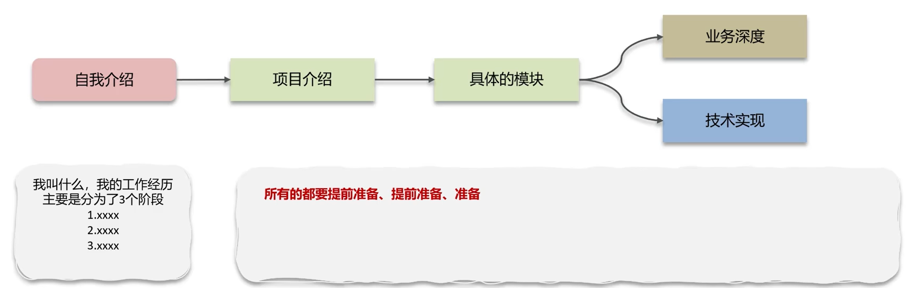

# 跳槽笔记

​	此笔记用于记录包括，简历筛选，简历书写等事项。

### 简历筛选规则

​	简历的筛选，通常会由hr进行初步筛选后，然后将简历分发到各个需要的部门领导手上，然后在进行二次，三次面试来结束，所以适当了解筛选规则，有利于赢得面试。

* hr筛选简历的方式
  * 学历，院校（应届生）
  * 经验
  * 年龄
  * 跳槽频次（较为重要，最好5年不超过3次）
* 部门负责人筛选
  * 符合当前项目的技术栈
  * 符合业务条件（原本从事过该行业业务开发，银行，电商，物流）
  * 额外加分项：
    * 有高并发高可用经验
    * 熟悉公有云
    * 有团队管理经验

### 面试过程

整体讲解结构：总分结构表述

* 自我介绍
  * 叫什么
  * 工作经历阶段，分为几个阶段
* 项目介绍
  * 描述项目功能，使用技术，个人负责模块等

* 具体模块
  * 业务深度
  * 技术实现

**切记，所有的都要提前准备、提前准备、准备！**

#### 心态问题

​	**求其上，得其中，求其中，得其下，求其下，必败**

