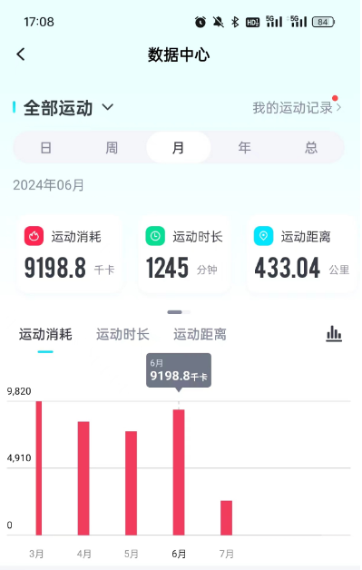
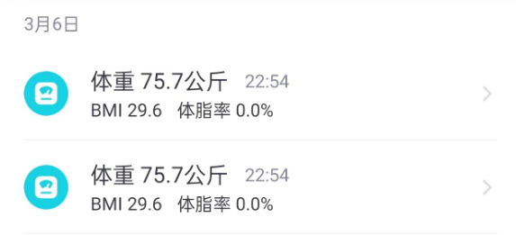
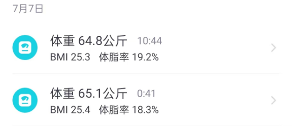
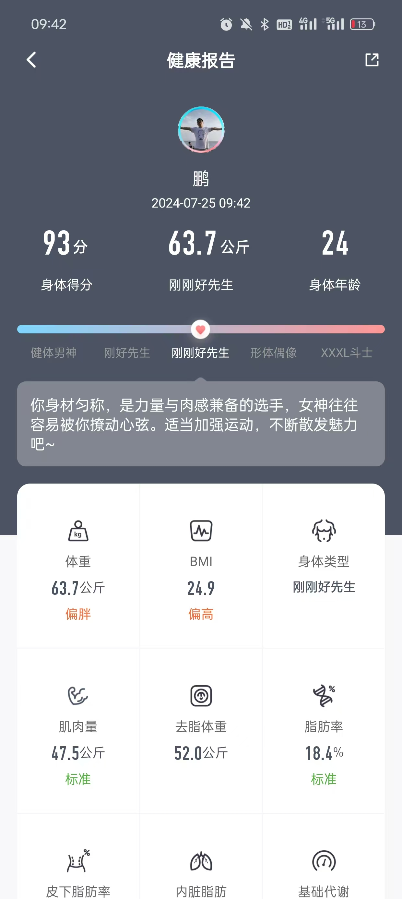
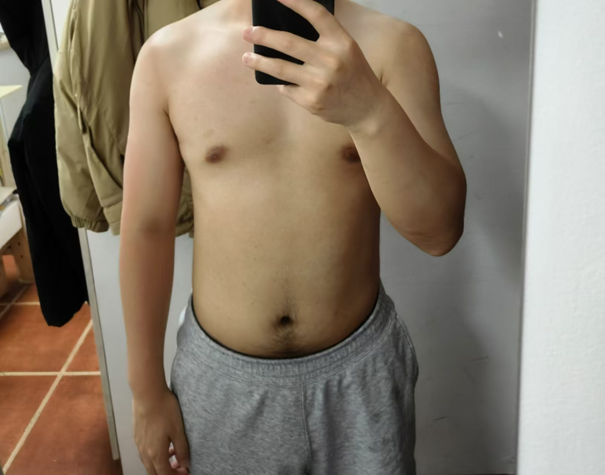
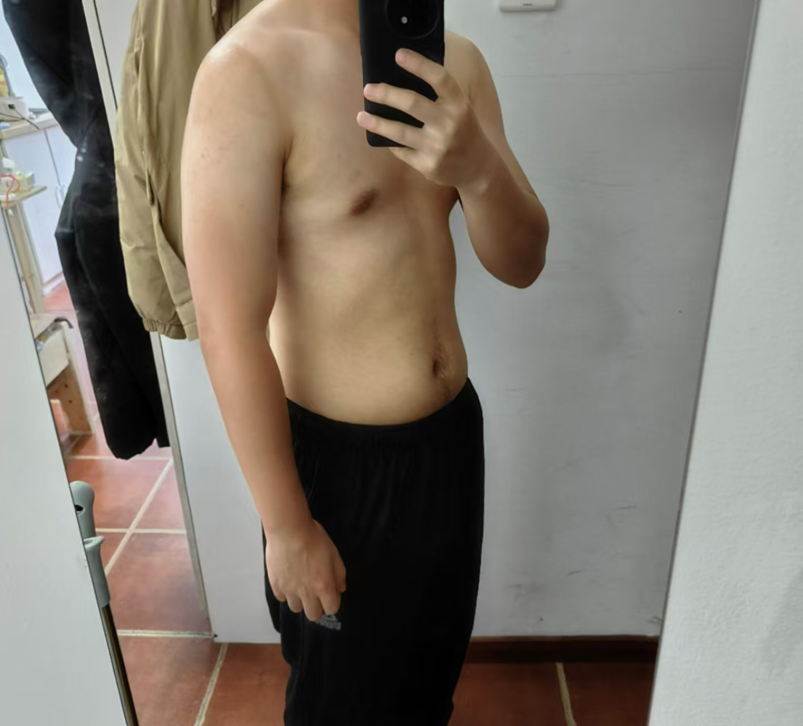

# 身材管理

​	身材管理这块，我先介绍一下我的情况，在半年前，打击到丝毫没有自信的时候，我最高达到了155斤的情况，而我只有160cm，所以当时我的身体是非常不健康的。半年后的现在，我减下了25斤，目前处于一个中等身材阶段。下一个目标，我需要将全身肌肉练起来。而这个部分呢，我会分为两个部分来讲述：

* 减重减脂
* 增加肌肉

## 减重减脂

​	我自己呢，是买了个动感单车，每天固定早上8点起床20-30分钟骑行，晚上进行40分钟。如果你刚开始减脂，希望你也能将运动时间分段，因为这样会减少你的身体不适，也更容易打破瓶颈期。如下图所示：

找不到年初的记录了，大概就是4个月20斤左右把。

## 增加肌肉

​	这块主要涉及到力量训练，当你的体重到达，30=身高（cm）-体重（斤）这个阶段的时候，就可以开始逐步增加肌肉训练了。我是这么做的，在保证每天40分钟到一个小时的有氧下，增加无氧运动：

* 哑铃推肩4组，一组10-15个
* 哑铃卧推4组，一组10-15个
* 哑铃弯举4组，一组10-15个

重量的话，尽量能让你每一次做完都有力竭的感觉最好，在35=身高（cm）-体重（斤）前，都先这样做，后续再增加强度，最终会变成这样，后续在增加强度即可。

## 7月28记录

* 目前体重已经来到127斤

* 体态变化如下

